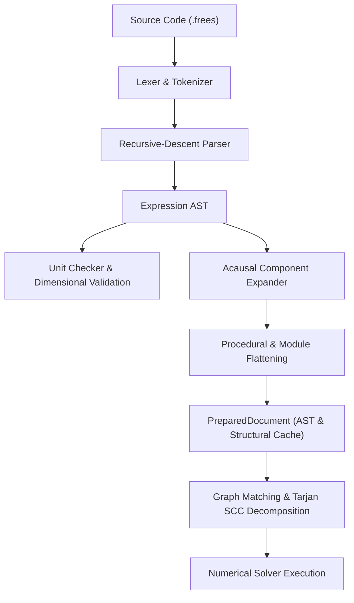

# Architecture and Requirements Specification

This document provides the authoritative technical architecture, system design, and requirements specification for `frees` (`frees-wasm`).

---

## 1. Executive Summary & System Vision

`frees` is a high-performance, declarative physical systems modeling, equation solving, and simulation platform. It unites an acausal equation-oriented modeling language, symbolic and numerical algebra engines, high-accuracy thermodynamic and thermophysical property calculations, differential-algebraic equation (DAE) integrators, and an interactive scientific computing workbook.

### Architectural Philosophy

1. **Zero External Backend**: The entire computational engine compiles to WebAssembly (`wasm32-unknown-unknown`) and executes client-side inside Web Workers in modern browsers, accompanied by a native desktop CLI (`frees-cli`). No network calls or server round-trips are made for model checking, solving, or plotting.
2. **Deterministic Reproducibility**: Mathematical calculations adhere to strict double-precision IEEE 754 floating-point standards, exact analytical symbolic derivatives, and frozen regression verification.
3. **Target-Agnostic Core**: The core numerical engine (`crates/frees-core`) is completely independent of WebAssembly, browser APIs, or JavaScript glue code, enabling headless execution, batch processing, and embedded compilation.
4. **Data Ownership & Privacy**: User models, proprietary thermodynamic parameters, experimental datasets, and simulation outputs remain entirely within the user's browser storage (IndexedDB) or local filesystem.

---

## 2. System Architecture & Crate Topology

```
frees-wasm/
├── Cargo.toml                    # Root workspace definition and compiler optimization profiles
├── rust-toolchain.toml           # Pinned stable Rust toolchain and wasm32-unknown-unknown target
├── crates/
│   ├── frees-core/               # Pure Rust numerical and modeling engine (target-agnostic)
│   │   ├── ast/                  # Abstract Syntax Tree nodes (Expr, Equation, Block, Component)
│   │   ├── parser/               # Lexer, recursive-descent parser, expander, and registries
│   │   ├── units/                # Dimensional analysis, conversion factors, and unit checker
│   │   ├── solver/               # Tarjan SCC blocker, Newton-Raphson, Powell dogleg, prepared solver
│   │   ├── ode/                  # Adaptive Runge-Kutta (ode45) and Radau IIA (radau5)
│   │   ├── dae/                  # Variable-coefficient BDF / IDA integrator with event localization
│   │   ├── props/                # Fluid, mixture, and moist air thermodynamic models (rustprop)
│   │   ├── cas/                  # Rational symbolic CAS, simplification, differentiation, matrices
│   │   ├── control/              # Transfer functions, state-space, Riccati, frequency response
│   │   ├── optimize/             # Unconstrained and bound-constrained optimization, Nelder-Mead
│   │   └── components/           # 295+ standard acausal components and connection expander
│   ├── frees/                    # WebAssembly interface crate (wasm-bindgen JSON RPC bridge)
│   └── frees-cli/                # Headless command-line binary (solve, check, export)
└── web/                          # Modern React 19 / TypeScript Progressive Web Application
    ├── src/
    │   ├── wasm/                 # Web Worker pool client, WASM lifecycle, request multiplexing
    │   ├── schematic/            # Interactive acausal schematic editor, symbols, connection validation
    │   ├── tablesGrid/           # Glide Data Grid workbook, CSV import/export, callable lookups
    │   ├── plots/                # Plotly.js charts, thermodynamic state overlays, decimation
    │   ├── modelRevision.ts      # Monotonic revision tracker preventing race conditions
    │   ├── projectStore.ts       # IndexedDB project library and durable autosave mirror
    │   └── docs/                 # In-app user documentation and component reference catalog
    └── scripts/                  # Manifest generators and documentation compiler
```

### Module Boundary Invariants

- **`crates/frees-core`**:
  - Must never import `wasm-bindgen`, `js-sys`, `web-sys`, or any browser-specific crates.
  - Compiles cleanly on both native targets (`x86_64`, `aarch64`) and `wasm32-unknown-unknown`.
  - All algorithms must be self-contained or depend strictly on verified pure-Rust crates.
- **`crates/frees`**:
  - Acts as the sole boundary between Rust and JavaScript.
  - Exposes entry points via `wasm-bindgen` receiving and returning typed JSON strings (`solve`, `solveTable`, `check`, `propertyDiagram`, `psychrometricChart`, `replEvaluate`, `monteCarlo`, `optimize`).
  - Serializes structured error responses with accurate line and column spans rather than panicking.
- **`web/src/wasm/engineClient.ts`**:
  - Encapsulates the Web Worker lifecycle as a singleton client.
  - Lazily spawns a pool of up to 4 Web Workers (automatically clamped to 2 on devices with $\le 4\text{ GB}$ memory).
  - Correlates asynchronous messages by monotonic request ID.
  - Distributes independent parametric sweep rows across workers with weighted progress aggregation while preserving strict row ordering.
  - Retires idle workers gracefully, rejecting stranded requests with clean cancellations.
  - Recovers from catastrophic WebAssembly traps by terminating all workers and respawning on the next request.

---

## 3. Modeling Language Grammar & AST Lowering Pipeline

The `frees` modeling language is a declarative, acausal engineering language designed for physical systems simulation.

### Language Characteristics

- **Declarative Non-Assignment Equations**: Equations express mathematical equality (`lhs = rhs`). The solver determines causality automatically.
- **Case-Insensitive Identifiers**: Variable and function lookups are case-insensitive (`Pressure` and `pressure` refer to the same symbol), but user-defined casing is preserved in output display maps.
- **Engineering Units**: Quantities support bracketed unit expressions (e.g., `P = 200 [kPa]`, `h = 320.5 [kJ/kg]`). The unit engine checks dimensional consistency and computes exact SI conversion factors.
- **String Variables**: Identifier names ending with `$` designate string values (e.g., `fluid$ = 'Water'`), commonly used for fluid selection and mode switching.
- **Variable Bounds and Directives**: Users can specify initial guesses, lower bounds, upper bounds, and uncertainties via inline directives (e.g., `GUESS x = 2.5 [0, 10]`).

### Top-Level Blocks

1. **`COMPONENT` / `MODULE`**: Reusable acausal physical devices with typed ports (`flow` and `potential` variables) and internal equations.
2. **`FUNCTION`**: Procedural single-output computational routines supporting imperative control flow (`if`, `for`, `repeat`).
3. **`PROCEDURE`**: Multi-output procedural blocks returning multiple calculated values.
4. **`TABLE`**: 1D and 2D lookup data grids callable from within algebraic equations via interpolation functions.
5. **`PARAMETRIC`**: Parametric sweep specifications defining independent variables, ranges, and recorded outputs.
6. **`DYNAMIC`**: Dynamic system definitions specifying differential state variables (`der(x)` or `x'`), time intervals, integrator options, and event conditions.
7. **`PLOT`**: Declarative visualization definitions binding solved variables to chart types and axes.
8. **`STATETABLE`**: Thermodynamic state tables defining fluid states across processes.
9. **`LINEARIZE`**: Operating-point linearization for state-space extraction and control design.
10. **`SYMBOLIC`**: Symbolic algebra directives for closed-form simplification and solution.

### Compilation and Lowering Pipeline



### Prepared Solver Architecture (`PreparedDocument`)

For parametric sweeps, optimization loops, and interactive slider adjustments, the model structure does not change between iterations. Re-parsing and re-analyzing the AST introduces unnecessary overhead.

The `PreparedDocument` infrastructure hovers above the solver:
- **Structural Analysis Hoisting**: AST parsing, component expansion, variable indexing, block decomposition, analytic differentiation, and dense execution plans are computed once and retained.
- **In-Place Pin Mutation**: Numeric parameter overrides update solver state vectors directly in memory without re-parsing.
- **Lowered Pin Routing**: Complex-mode coordinates (`_r`/`_i`), stepped integrals, array indices (`x[1]`), and component members (`pump.P`) route through `with_source_pins` to preserve structural identity.

---

## 4. Numerical Core & Equation Solving

### Structural Decomposition & Bipartite Matching

1. **Degree of Freedom Analysis**:
   - The engine constructs a bipartite graph connecting equations to unknown variables.
   - Hopcroft-Karp maximum bipartite matching verifies solvability:
     - Number of equations = number of unknowns: structurally solvable ($DOF = 0$).
     - Under-determined ($DOF > 0$): reports unconstrained variables.
     - Over-determined ($DOF < 0$): identifies redundant or contradictory equations.
2. **Tarjan's Strongly Connected Components (SCC)**:
   - Unknowns and equations are transformed into a directed dependency graph.
   - Tarjan's algorithm decomposes the global system into a sequence of minimal coupled sub-blocks.
   - Independent scalar equations solve trivially without iterative machinery.
   - Coupled nonlinear blocks are isolated and solved in dependency order, reducing a system of $N$ equations to several sub-problems of size $n_i \ll N$.

### Nonlinear Solvers

For each coupled block $F(x) = 0$:

1. **Analytical Jacobian Evaluation**:
   - The symbolic engine differentiates expressions analytically to populate the Jacobian matrix $J_{ij} = \frac{\partial F_i}{\partial x_j}$.
   - Exact derivatives eliminate truncation errors and finite-difference evaluation costs.
2. **Scaled Newton-Raphson**:
   - Variable and residual diagonal preconditioning scales variables of disparate magnitudes (e.g., pressure in Pa vs. mass flow in kg/s).
   - Solves $J \Delta x = -F(x)$ via LU or QR factorization.
3. **Globalization Strategies**:
   - **Armijo Line Search**: Step halving along the Newton direction ensures sufficient decrease of the residual norm $\|F(x)\|_2$.
   - **Powell Hybrid Dogleg**: For difficult starting conditions or ill-conditioned Jacobians, smoothly interpolates between the steepest descent Cauchy step and the full Newton step.
4. **Rank-Deficient Recovery & Polish**:
   - If an intermediate Jacobian encounters numerical singularity, the solver performs SVD-based regularized steps or merges adjacent dependent blocks.
   - A final high-precision polish pass verifies residual convergence to within specified tolerances (default relative residual $\le 10^{-6}$, variable change $\le 10^{-9}$).

---

## 5. Dynamic Systems: ODE & DAE Solvers

### Ordinary Differential Equations (ODE)

Dynamic systems governed by $\frac{dy}{dt} = f(t, y)$ are integrated using:
- **Adaptive Dormand-Prince 5(4) (`ode45`)**: Embedded Runge-Kutta pair with local truncation error estimation and adaptive step-size selection for non-stiff systems.
- **Radau IIA 5th-Order (`radau5`)**: Fully implicit Runge-Kutta method with 3 stages for stiff differential equations, providing strong stability ($A$-stable and $L$-stable).

### Differential-Algebraic Equations (DAE)

General constrained physical systems formulated as:
$$F(t, y, y') = 0$$
where $y$ contains both differential states and algebraic variables:
- **Variable-Coefficient BDF / IDA**: Variable-order, variable-coefficient Backward Differentiation Formulas (orders 1 through 5).
- **Direct Linear Solvers**: Coupled Newton iterations at each time step solve the augmented Jacobian matrix $J = \frac{\partial F}{\partial y} + \alpha \frac{\partial F}{\partial y'}$.
- **Zero-Crossing Event Localization**: Discontinuous events (e.g., pressure relief valves opening, check valves seating, thermodynamic phase transitions) are formulated as zero-crossings of switching functions $g_k(t, y, y') = 0$. The solver uses Brent's root-finding method to locate the exact event time $t^*$, applies discrete state transitions, and restarts the integrator cleanly.

---

## 6. Thermodynamic & Thermophysical Property System

### Pure-Rust Property Backend (`rustprop`)

Thermodynamic calculations are powered by `rustprop`, a pure-Rust implementation of CoolProp 8.0.0 algorithms, compiled directly into the WebAssembly binary with zero C/C++ FFI or external runtime dependencies.

### Capabilities

1. **Multiparameter Helmholtz Energy Formulations**:
   - High-accuracy fundamental equations of state explicit in reduced Helmholtz energy $\alpha(\delta, \tau) = \alpha^0(\delta, \tau) + \alpha^r(\delta, \tau)$ where $\delta = \rho/\rho_c$ and $\tau = T_c/T$.
   - Evaluates all thermodynamic properties (pressure, density, enthalpy, entropy, internal energy, specific heat capacities $c_p$, $c_v$, sound speed, Joule-Thomson coefficient) via exact partial derivatives of $\alpha$.
2. **Supported Fluid Classes**:
   - Standard pure fluids: `Water`, `R134a`, `R1234yf`, `CO2`, `Ammonia`, `Methane`, `Nitrogen`, `Oxygen`, `Air`, `Helium`, `Hydrogen`, `Propane`, `Isobutane`, and 120+ additional fluids.
   - Saturated liquid and vapor states, saturation curves, and two-phase mixture properties parameterized by vapor quality $Q \in [0, 1]$.
   - Incompressible fluids and aqueous mixtures (`INCOMP::MEG[x]`, `INCOMP::MPG[x]` aqueous ethylene/propylene glycol) with exact concentration node mapping.
3. **Psychrometrics & Moist Air (`HAPropsSI`)**:
   - Real-gas moist air calculations based on ASHRAE RP-1485 formulations.
   - Properties: dry-bulb temperature, wet-bulb temperature, dew-point temperature, relative humidity, humidity ratio, moist air enthalpy, entropy, specific volume.
4. **Auxiliary Property Grids (`FRAUX1`)**:
   - Tabular evaluation grids for fast transport property evaluation (viscosity, thermal conductivity) and domain regions outside saturation domes.

---

## 7. Symbolic CAS & Control Systems

### Built-in Symbolic Engine

To maintain an MIT-compatible license and eliminate heavy third-party CAS dependencies, `frees` incorporates a custom symbolic algebra kernel written over exact rational arithmetic (`num-rational` and `num-bigint`).

- **Exact Arithmetic**: Integers and rationals maintain arbitrary precision without floating-point roundoff.
- **Canonical Simplification**: Commutative/associative term collection, identity reductions, power expansion, and rational fraction canonicalization.
- **Analytic Partial Differentiation**: Recursive differentiation of standard mathematical operators and transcendental functions.
- **Symbolic Matrix Operations**: Symbolic determinants, matrix inversion, characteristic polynomials, and linear system solvers.

### Control Systems & Linear Analysis

- **System Representations**: Continuous and discrete transfer functions ($G(s)$, $H(z)$) and state-space realizations ($\dot{x} = Ax + Bu, y = Cx + Du$).
- **Time-Domain Simulation**: Analytic and numerical evaluation of step responses, impulse responses, and arbitrary input convolutions.
- **Frequency-Domain Analysis**: Frequency response vectors, Bode magnitude and phase plots, Nyquist contours, and automated stability margin calculation (gain margin, phase margin, gain crossover frequency, phase crossover frequency).
- **State-Feedback & Optimal Control**: Continuous-time algebraic Riccati equation (CARE) solver using Hamiltonian matrix Schur decomposition for Linear Quadratic Regulator (LQR) synthesis.

---

## 8. User Interface, Tables & Data Visualization

### Frontend Technology Stack

- **Framework**: React 19 with TypeScript, utilizing functional components and hooks.
- **Build Tooling**: Vite with optimized vendor chunking and Rollup visualizer.
- **Code Editing**: Dual support for Monaco Editor and CodeMirror 6 with custom syntax highlighting, autocomplete for physical constants and intrinsic functions, and inline diagnostics.
- **Styling**: Tailwind CSS with fully responsive mobile and desktop layouts and dark/light theme support.

### Interactive Engineering Workbook (Glide Data Grid)

- **Performance**: Canvas-rendered virtualized grid capable of handling $1,000,000+$ cells at 60 FPS scrolling.
- **Function Tables**: Tables defined in the workbook are directly callable in equations as interpolation functions (`lookup`, `lookuprow`, `nlookuprows`).
- **Data Integrity**: Double-precision floating-point values are preserved in memory; display formatting does not alter underlying numerical data.
- **Interoperability**: High-speed RFC 4180 CSV import and export with automatic header and delimiter detection.

### Scientific Plotting Engine (Plotly.js)

- **Plot Types**: XY scatter/line, dual Y-axis, parametric curve families, 3D surface and scatter, contour plots, and statistical histograms.
- **Thermodynamic Diagram Overlays**: Automated background generation of $T$-$s$ (temperature-entropy), $P$-$h$ (pressure-enthalpy), $h$-$s$ (Mollier), and psychrometric charts with saturation domes, quality lines, and solved thermodynamic cycle state overlays.
- **Adaptive Decimation**: Large transient ODE trajectories ($> 10,000$ points) are dynamically decimated using Largest-Triangle-Three-Buckets (LTTB) algorithms for smooth browser interaction.
- **Export Formats**: Client-side vector SVG and high-resolution raster PNG export.

---

## 9. Offline Progressive Web Application (PWA) & Storage Architecture

### Offline PWA Infrastructure

- **Service Worker**: Managed via Workbox and `vite-plugin-pwa`.
- **Pre-Caching**: Application shell, WebAssembly binary (`frees.wasm`), web workers, font assets, and component catalogs are cached locally upon initial visit.
- **Offline Availability**: Fully operational without network access once cached.

### Storage Hierarchy (`projectStore.ts`)

1. **Active Working Memory**: React state and Web Worker memory represent the live editing session.
2. **Autosave Mirror**: Debounced background writes persist active document changes to IndexedDB every 500 ms.
3. **Multi-Project Library**: IndexedDB stores user projects with UUID keys, project metadata, timestamps, table workbooks, and schematic layouts.
4. **File Import / Export**: Native `.frees` and `.json` project file downloads and uploads via HTML5 File API.

---

## 10. System Requirements & Performance Targets

### WebAssembly Engine Constraints

| Metric | Specification Target | Current Status |
|---|---|---|
| **Raw WASM Size** | $\le 4,096\text{ KiB}$ | ~3,283 KiB (~1,344 KiB gzipped) |
| **Engine Cold Boot** | $\le 250\text{ ms}$ | $\approx 120\text{ ms}$ |
| **Linear Memory Baseline** | $\le 64\text{ MiB}$ initial | $\approx 32\text{ MiB}$ |
| **Peak Linear Memory** | $\le 256\text{ MiB}$ during complex sweeps | Verified within budget |
| **Worker Concurrency** | 1–4 workers | Clamped to 2 on devices with $\le 4\text{ GB}$ RAM |

### Solver Performance Latencies

| System Complexity | Equation Count | Target Solve Latency |
|---|---|---|
| **Small Analytical** | $1$–$20$ equations | $< 2\text{ ms}$ |
| **Medium Coupled System** | $20$–$100$ equations | $< 15\text{ ms}$ |
| **Complex Thermal / Power Plant** | $100$–$500$ equations | $< 100\text{ ms}$ |
| **Large DAE Transient Simulation** | $1,000$ steps, 50 states | $< 500\text{ ms}$ |
| **Parametric Sweep** | $100$ runs $\times 50$ equations | $< 1,500\text{ ms}$ (multi-worker) |

### Browser Compatibility Requirements

- **Supported Modern Browsers**: Chrome $\ge 115$, Firefox $\ge 115$, Safari $\ge 16.4$, Edge $\ge 115$.
- **Required Web APIs**: WebAssembly, Web Workers, IndexedDB, Canvas 2D, ES2022 JavaScript.
- **Node.js Environment (Development & CI)**: Node 22 (LTS) required for test runner compatibility.
