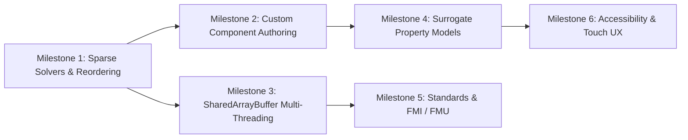

# Engineering Roadmap & Next Steps

This document outlines the forward-looking engineering roadmap, upcoming milestones, and quality acceptance gates for `frees` (`frees-wasm`).

---

## 1. Verified Architecture & Current Baseline

The project has achieved an end-to-end client-side WebAssembly modeling platform with zero backend dependencies:

- **Target-Agnostic Core (`frees-core`)**: Scaled Newton-Raphson, Powell hybrid dogleg, adaptive ODE integrators (`ode45`, `radau5`), index-1 DAE BDF/IDA solver with event root-finding, and an exact rational symbolic CAS.
- **Thermodynamic Property Backbone (`rustprop`)**: Pure-Rust CoolProp 8.0.0 implementation supporting multiparameter Helmholtz energy equations of state, incompressibles, and ASHRAE moist air psychrometrics (`HAPropsSI`).
- **WebAssembly Bridge & Worker Pool (`frees`, `engineClient.ts`)**: Structured JSON RPC boundary hosting a pool of up to 4 Web Workers with dynamic concurrency clamping, request correlation, weighted sweep progress, and deterministic row re-assembly.
- **Interactive Workbench (`web`)**: React 19 / TypeScript application featuring Glide Data Grid virtualized tables, Plotly.js scientific plotting with thermodynamic diagram overlays, CodeMirror/Monaco editor support, and offline PWA caching via IndexedDB.
- **Strict Quality Gates**: 1,308 golden regression fixtures passing with zero regressions, 53 frontend Vitest test suites (597 tests) passing, clean clippy `-D warnings` on native and `wasm32-unknown-unknown`, and WASM bundle strictly gated under the 4,096 KiB ceiling (~3,283 KiB raw).

---

## 2. Active Engineering Milestones



### Milestone 1: Sparse Matrix Factorization & Scaled Linear Algebra

**Objective**: Extend solver scalability from hundreds of coupled equations to large-scale networks with $> 5,000$ equations and states.

- **Fill-Reducing Ordering Algorithms**:
  - Implement Approximate Minimum Degree (AMD) and Column Approximate Minimum Degree (COLAMD) permutation strategies to minimize fill-in during factorization.
- **Sparse Direct Factorization Kernels**:
  - Integrate pure-Rust sparse LU and QR decomposition routines.
  - Exploit structural sparsity of acausal network Jacobians (typically $< 3\%$ non-zero entries).
- **Symbolic Factorization Reuse**:
  - Cache the non-zero sparsity pattern across successive Newton iterations and ODE/DAE integration steps.
  - Perform numerical refactorization in-place without recomputing symbolic elimination trees.

### Milestone 2: Custom Component Authoring & Schematic Enhancements

**Objective**: Enable users to design, encapsulate, and share reusable custom components directly within the interactive environment.

- **Visual Sub-Model Packaging**:
  - Provide a UI workflow to select a subset of schematic components and encapsulate them into a composite `COMPONENT` with exposed ports.
  - Generate clean declarative `.frees` component definitions automatically from graphical layouts.
- **User-Defined Symbol Rendering**:
  - Allow custom SVG glyphs and pin layout definitions for user-authored components.
  - Support visual badges indicating fluid state, flow direction, and port connection status.
- **Advanced Schematic Routing**:
  - Implement obstacle-avoiding orthogonal wire routing with clean visual junction nodes.
  - Add interactive port hovering with compatible-variable validation (e.g., preventing connection of fluid ports to mechanical rotational ports).

### Milestone 3: Multithreading via SharedArrayBuffer Research

**Objective**: Explore zero-copy memory concurrency for high-throughput parametric sweeps and Monte Carlo runs.

- **Cross-Origin Isolation Deployment Strategies**:
  - Investigate hosting configurations requiring `Cross-Origin-Opener-Policy: same-origin` and `Cross-Origin-Embedder-Policy: require-corp` headers across static CDNs (Vercel, GitHub Pages, custom domains).
  - Design a graceful fallback path ensuring the existing Web Worker message-passing architecture remains functional when cross-origin isolation is unavailable.
- **Shared Memory Data Buffers**:
  - Research direct shared-memory exchange of parameter vectors and result tables between the UI thread and WASM worker instances, bypassing JSON string serialization overhead for sweeps exceeding 10,000 rows.

### Milestone 4: Neural & Surrogate Thermophysical Property Models

**Objective**: Accelerate inner-loop property evaluation by 10–50x during iterative Newton solving without sacrificing final solution accuracy.

- **Domain-Bounded Surrogate Evaluators**:
  - Train compact polynomial or lightweight neural network surrogate functions over bounded operating ranges (e.g., subcooled liquid, superheated vapor) for common working fluids (`Water`, `R134a`, `CO2`).
- **Adaptive Predictor-Corrector Property Loops**:
  - Employ surrogate evaluations during intermediate Newton globalization steps.
  - Switch to exact Helmholtz energy formulations (`rustprop`) for final convergence verification and state reporting, guaranteeing physical precision.

### Milestone 5: Open Standards & Interoperability (FMI / FMU)

**Objective**: Interoperate with industrial engineering tools and multi-domain simulation environments.

- **Functional Mock-up Interface (FMI 2.0 / 3.0)**:
  - Implement export of solved dynamic models as Functional Mock-up Units (FMUs) for Model Exchange and Co-Simulation.
  - Package model equations, compiled WebAssembly or C artifacts, and `modelDescription.xml` metadata according to the FMI standard.
- **Modelica Standard Library Alignment**:
  - Harmonize connector definitions and acausal flow/potential conventions with Modelica standard conventions to facilitate model interchange.

### Milestone 6: Accessibility & Touch Ergonomics

**Objective**: Deliver a seamless modeling experience on touch devices (tablets) and ensure compliance with accessibility standards.

- **Tactile Canvas Interactions**:
  - Support multi-touch gestures (pinch-to-zoom, two-finger panning, long-press context menus) on the schematic canvas.
  - Enlarge touch target bounding boxes for component ports and connection terminals.
- **Accessibility (a11y) Compliance**:
  - Ensure full WCAG 2.1 AA compliance across all UI components.
  - Complete ARIA labelling, focus management, and screen-reader announcements for model validation errors, solver progress, and table navigation.
  - Provide full keyboard navigation for the schematic canvas and Glide Data Grid workbook.

---

## 3. Quality & Change Control Acceptance Gates

Every proposed change to the codebase must pass all automated verification gates prior to integration:

### 1. Rust Engine Quality Gates

```bash
# Code formatting check
cargo fmt --all --check

# Strict linting across native and wasm targets
cargo clippy --workspace --all-targets -- -D warnings
cargo clippy --workspace --target wasm32-unknown-unknown --all-targets -- -D warnings

# Core unit and integration test suite
cargo test --workspace -- --skip golden_corpus_parity

# Full golden regression corpus replay (1,308 fixtures)
cargo test --release --test parity
```

- **Zero Regression Policy**: All 1,308 golden fixtures must pass within declared tolerance specifications (`fixtures/tolerances-rustprop.json`).
- **Dead Tolerance Detection**: Relaxed tolerances that become unnecessary must be removed; CI fails if an unused tolerance entry remains.

### 2. Frontend & WebAssembly Gates

```bash
# Frontend test suite (Node 22 required)
cd web && npm test

# ESLint code quality verification
npm run lint

# Production bundle compilation and PWA asset generation
npm run build
```

- **Node 22 Toolchain Requirement**: Pinned in `web/.nvmrc`. Node 22 is strictly required for Vitest test runner compatibility.
- **Bundle Budget Ceiling**: The compiled WebAssembly engine (`frees.wasm`) must strictly remain $\le 4,096\text{ KiB}$ raw. Any PR exceeding this budget fails CI automatically.

### 3. Implementation Invariants

1. **Root-Cause Engineering**: Address bugs and inefficiencies at their fundamental source in the compiler or solver, rather than introducing conditional patches in callers.
2. **Target Agnosticism**: Keep `crates/frees-core` free of browser-specific or WASM-specific APIs.
3. **Model Revision Integrity**: Always verify `isCurrent(revision)` before committing asynchronous solver or sweep results to the user interface.
4. **Symbol Case-Insensitivity**: Maintain case-insensitive identifier lookup in the engine while preserving declared casing in user-facing tables and display maps.
