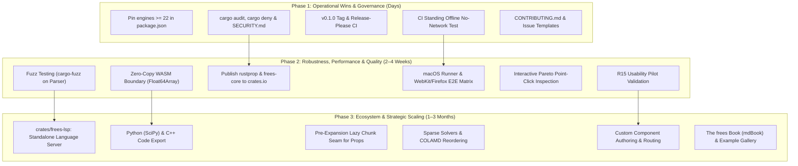

# Engineering Roadmap & Phased Execution Plan

This document outlines the phased engineering roadmap, active milestones, and quality acceptance gates for `frees` (`frees-wasm`).

---

## 1. Verified Architecture & Current Baseline

The project provides an end-to-end client-side WebAssembly modeling platform with zero external backend dependencies:

- **Target-Agnostic Core (`frees-core`)**: Scaled Newton-Raphson, Powell hybrid dogleg, adaptive ODE integrators (`ode45`, `radau5`), index-1 DAE BDF/IDA solver with event root-finding, and an exact rational symbolic CAS.
- **Thermodynamic Property Backbone (`rustprop`)**: Pure-Rust CoolProp 8.0.0 implementation supporting multiparameter Helmholtz energy equations of state, incompressibles (`INCOMP::MEG`, `MPG`), and ASHRAE moist air psychrometrics (`HAPropsSI`).
- **WebAssembly Bridge & Worker Pool (`frees`, `engineClient.ts`)**: Structured JSON RPC boundary hosting a pool of up to 4 Web Workers with dynamic concurrency clamping, request correlation, weighted sweep progress, and deterministic row re-assembly.
- **Interactive Workbench (`web`)**: React 19 / TypeScript application featuring Glide Data Grid virtualized tables, Plotly.js scientific plotting with thermodynamic diagram overlays, CodeMirror/Monaco editor support, shareable URL links (`#share=<lz-string>`), and offline PWA caching via IndexedDB.
- **Strict Quality Gates**: 1,308 golden regression fixtures passing with zero regressions, 52 frontend Vitest test suites (596 tests) passing, clean clippy `-D warnings` on native and `wasm32-unknown-unknown`, and WASM bundle strictly gated under the 4,096 KiB ceiling (~3,283 KiB raw).

---

## 2. Phased Implementation Plan



---

### Phase 1: Immediate Operational Wins & Governance (Target: Days)

Focus: Low-risk, high-impact developer ergonomics, supply-chain security, and release automation.

- [ ] **1.1 Enforce Node 22 in Toolchain Configuration**
  - Add `"engines": { "node": ">=22" }` to `web/package.json` to prevent cryptic `jsdom` / `undici` initialization crashes under Node 20.
- [ ] **1.2 Supply-Chain Hardening & Security Policy**
  - Integrate `cargo audit` and `cargo deny` (checking licenses, bans, and advisories) into `.github/workflows/ci.yml`.
  - Add `npm audit --omit=dev` to the frontend CI pipeline.
  - Author `SECURITY.md` establishing a formal vulnerability disclosure and triage protocol.
- [ ] **1.3 Release Engineering & Automation**
  - Tag initial release `v0.1.0`.
  - Configure Release-Please to automate semantic version bumps and `CHANGELOG.md` generation from conventional commits.
  - Add automated GitHub release asset publishing: compiled WebAssembly package, zipped `web/dist` PWA artifact, and native `frees-cli` binaries for Linux, macOS, and Windows.
- [ ] **1.4 Standing Offline ("No-Network") CI Invariant**
  - Add a dedicated Playwright test step in CI that routes all non-same-origin requests to `route.abort()` and verifies model solving, diagram plotting, and table export complete successfully offline.
- [ ] **1.5 Contributor Onboarding & Issue Templates**
  - Add `CONTRIBUTING.md` detailing coding standards, PR expectations, and verification commands.
  - Configure GitHub issue templates (`.github/ISSUE_TEMPLATE/`) for bug reports, engine numerics, and documentation improvements.

---

### Phase 2: Robustness, Kernel Performance & Quality (Target: 2–4 Weeks)

Focus: Eliminating data transfer bottlenecks, preventing parser crashes, expanding test matrices, and validating user ergonomics.

- [ ] **2.1 Zero-Copy Typed Array WASM Boundary**
  - Replace JSON string serialization for bulk numeric results (transient ODE trajectory tables and multi-row parametric sweeps) with `js_sys::Float64Array` and transferable `ArrayBuffer` views.
  - Maintain JSON envelopes for variable names, status codes, and units while transferring data matrices in $O(1)$ time across Web Workers via `postMessage(msg, [buffer])`.
- [ ] **2.2 Parser & Lexer Fuzz Testing (`cargo-fuzz`)**
  - Establish a `fuzz/` crate using `libFuzzer` targeting `frees_core::parser::parse_document` and expression evaluators.
  - Assert that randomized, malformed, or adversarial syntax inputs yield structured `Err(ParseError)` variants rather than triggering panic traps that kill the browser Web Worker.
- [ ] **2.3 Crates.io Publishing for Dependencies & Core Engine**
  - Publish `rustprop` to crates.io and update `Cargo.toml` from a git tag dependency to a versioned registry dependency with cryptographic checksums.
  - Publish `frees-core` and `frees-cli` to crates.io for embedding in external Rust applications.
- [ ] **2.4 Cross-Platform & Cross-Browser CI Matrix**
  - Add a macOS runner leg in CI to validate floating-point formatting and `libm` consistency across operating systems.
  - Expand Playwright test suites to run across a Chromium, Firefox, and WebKit (Safari) browser matrix to verify WebAssembly instantiation and IndexedDB storage resilience.
- [ ] **2.5 Interactive Pareto Point-Click Inspection**
  - Enhance `web/src/MinMaxModal.tsx` so clicking any point on the 2D Pareto front scatter plot highlights the corresponding decision variables and allows instant loading of the operating point into the active document.
- [ ] **2.6 R15 Usability Pilot Validation**
  - Execute the structured R15 usability pilot with 5 engineering participants to validate core modeling tasks (scalar solve within 5 minutes, component chain within 10 minutes, missing boundary recovery within 3 minutes) prior to adding complex UI extensions.

---

### Phase 3: Ecosystem, Tooling & Strategic Scaling (Target: 1–3 Months)

Focus: Expanding beyond the web tab into IDE ecosystems, standalone code generation, and large-scale sparse numerical solvers.

- [ ] **3.1 Standalone Language Server (`crates/frees-lsp`)**
  - Author a dedicated LSP server crate communicating over standard input/output.
  - Reuse `frees-core` AST parsing, unit checking, diagnostics, and component metadata to deliver real-time syntax highlighting, error squiggles, unit checking, autocomplete, and go-to-definition in VS Code, Neovim, and Helix.
- [ ] **3.2 Standalone Simulation Code Export (Python & C++)**
  - Implement an AST visitor exporting solved equation blocks and topological schedules to standalone Python scripts (using SciPy `fsolve` and `solve_ivp`) and self-contained C++ headers.
  - Provide engineers with auditable, citable, and dependency-free artifacts for embedding in enterprise simulation pipelines.
- [ ] **3.3 Pre-Expansion Lazy Chunk Seam for Thermodynamic Data**
  - Implement dynamic chunk fetching for property tables and component libraries (`props/tables.rs::install_from_bytes`) on first mention.
  - Safeguard the $\le 4,096\text{ KiB}$ WASM budget before adding new fluids (Ammonia, Propane, Nitrogen, Methane).
- [ ] **3.4 Sparse Matrix Factorization & Graph Reordering**
  - Implement Approximate Minimum Degree (AMD) and Column Approximate Minimum Degree (COLAMD) fill-reducing permutations.
  - Integrate pure-Rust sparse LU/QR factorizations (`faer` / `sprs`) with sparsity pattern reuse across Newton iterations for systems exceeding 5,000 equations.
- [ ] **3.5 Custom Component Authoring & Advanced Schematic Routing**
  - Provide a UI workflow for selecting a group of components on the schematic canvas and encapsulating them into a reusable custom `COMPONENT` block with exposed ports.
  - Implement obstacle-avoiding orthogonal wire routing with connection validation.
- [ ] **3.6 Comprehensive Documentation & Public Example Gallery**
  - Build an mdBook ("The frees Book") compiling language syntax, physical modeling principles, thermodynamic EoS fundamentals, and solver debugging guides.
  - Curate a public gallery of 30–50 verified engineering models from the regression corpus with interactive simulation previews.

---

## 3. Long-Term Research & Strategic Candidates

- **SharedArrayBuffer Multi-Threading**: Research cross-origin isolation (`COOP`/`COEP`) headers for zero-copy multi-threaded sweeps, with seamless fallback for standard static hosting environments.
- **Neural & Domain-Bounded Surrogate Property Models**: Train bounded surrogate evaluators for fast property estimation during Newton line-search steps, with exact Helmholtz verification at convergence.
- **Standards Interoperability (FMI / FMU 2.0/3.0)**: Package dynamic systems as Functional Mock-up Units for co-simulation in industrial engineering workflows.
- **Accessibility & Touch Ergonomics**: Full WCAG 2.1 AA compliance, enhanced screen reader announcements, and tactile multi-touch canvas navigation.

---

## 4. Quality & Change Control Acceptance Gates

Every proposed change to the codebase must pass all automated verification gates prior to integration:

### 1. Rust Engine Quality Gates

```bash
# Code formatting check
cargo fmt --all --check

# Strict linting across native and wasm targets
cargo clippy --workspace --all-targets -- -D warnings
cargo clippy --workspace --target wasm32-unknown-unknown --all-targets -- -D warnings

# Core unit and integration test suite
cargo test --workspace -- --skip golden_corpus_parity

# Full golden regression corpus replay (1,308 fixtures)
cargo test --release --test parity
```

- **Zero Regression Policy**: All 1,308 golden fixtures must pass within declared tolerance specifications (`fixtures/tolerances-rustprop.json`).
- **Dead Tolerance Detection**: Relaxed tolerances that become unnecessary must be removed; CI fails if an unused tolerance entry remains.

### 2. Frontend & WebAssembly Gates

```bash
# Frontend test suite (Node 22 required)
cd web && npm test

# ESLint code quality verification
npm run lint

# Production bundle compilation and PWA asset generation
npm run build
```

- **Node 22 Toolchain Requirement**: Pinned in `web/.nvmrc` and enforced via `package.json`.
- **Bundle Budget Ceiling**: The compiled WebAssembly engine (`frees.wasm`) must strictly remain $\le 4,096\text{ KiB}$ raw. Any PR exceeding this budget fails CI automatically.

### 3. Implementation Invariants

1. **Root-Cause Engineering**: Address bugs and inefficiencies at their fundamental source in the compiler or solver, rather than introducing conditional patches in callers.
2. **Target Agnosticism**: Keep `crates/frees-core` free of browser-specific or WASM-specific APIs.
3. **Model Revision Integrity**: Always verify `isCurrent(revision)` before committing asynchronous solver or sweep results to the user interface.
4. **Symbol Case-Insensitivity**: Maintain case-insensitive identifier lookup in the engine while preserving declared casing in user-facing tables and display maps.
