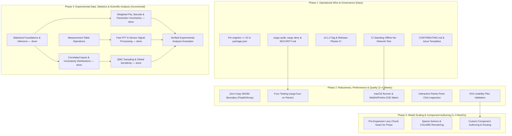

# Engineering Roadmap & Phased Execution Plan

This document outlines the phased engineering roadmap, active milestones, and quality acceptance gates for `frees` (`frees-wasm`).

---

## 1. Verified Architecture & Current Baseline

The project provides an end-to-end client-side WebAssembly modeling platform with zero external backend dependencies:

- **Target-Agnostic Core (`frees-core`)**: Scaled Newton-Raphson, Powell hybrid dogleg, adaptive ODE integrators (`ode45`, `radau5`), index-1 DAE BDF/IDA solver with event root-finding, and an exact rational symbolic CAS.
- **Thermodynamic Property Backbone (`rustprop`)**: Pure-Rust CoolProp 8.0.0 implementation supporting multiparameter Helmholtz energy equations of state, incompressibles (`INCOMP::MEG`, `MPG`), and ASHRAE moist air psychrometrics (`HAPropsSI`). 26 real fluids are linked and served on the diagram picker as of 2026-09-10 — every pure fluid `props/propfun.rs`'s alias table names.
- **WebAssembly Bridge & Worker Pool (`frees`, `engineClient.ts`)**: Structured JSON RPC boundary hosting a pool of up to 4 Web Workers with dynamic concurrency clamping, request correlation, weighted sweep progress, and deterministic row re-assembly.
- **Interactive Workbench (`web`)**: React 19 / TypeScript application featuring Glide Data Grid virtualized tables, Plotly.js scientific plotting with thermodynamic diagram overlays, CodeMirror/Monaco editor support, shareable URL links (`#share=<lz-string>`), and offline PWA caching via IndexedDB.
- **Experimental Data & Statistics (`analysis/`)**: descriptive and inferential statistics, weighted/bounded/robust curve fitting and dynamic calibration with parameter covariance, correlated and non-Gaussian input uncertainty (`Correlation(A, B)` / `DistributionOf(X)`), truncated inverse-CDF sampling, seeded Latin-hypercube and scrambled Sobol designs, Sobol' variance decomposition and Morris screening, and an `O(n log n)` transform with the sensor kernels built on it (`Detrend`, `Smooth`, `Window`, `Filter`, `FiltFilt`, `XCorr`, `Welch`, peak detection).
- **Strict Quality Gates**: 1,308 golden regression fixtures passing with zero regressions, 55 frontend Vitest test suites (620 tests) passing, clean clippy `-D warnings` on native and `wasm32-unknown-unknown`, a four-shard WASM golden-corpus replay plus a perturbation-detection gate in CI, and the WASM bundle strictly gated under the 5,120 KiB ceiling (~3,888 KiB raw).

---

## 2. Phased Implementation Plan



---

### Phase 1: Immediate Operational Wins & Governance (Target: Days)

Focus: Low-risk, high-impact developer ergonomics, supply-chain security, and release automation.

- [x] **1.1 Enforce Node 22 in Toolchain Configuration**
  - Add `"engines": { "node": ">=22" }` to `web/package.json` to prevent cryptic `jsdom` / `undici` initialization crashes under Node 20.
- [x] **1.2 Supply-Chain Hardening & Security Policy**
  - Integrate `cargo audit` and `cargo deny` (checking licenses, bans, and advisories) into `.github/workflows/ci.yml`.
  - Add `npm audit --omit=dev` to the frontend CI pipeline.
  - Author `SECURITY.md` establishing a formal vulnerability disclosure and triage protocol.
- [x] **1.3 Release Engineering & Automation**
  - Tag initial release `v0.1.0`.
  - Configure Release-Please to automate semantic version bumps and `CHANGELOG.md` generation from conventional commits.
  - Add automated GitHub release asset publishing: compiled WebAssembly package, zipped `web/dist` PWA artifact, and native `frees-cli` binaries for Linux, macOS, and Windows.
- [x] **1.4 Standing Offline ("No-Network") CI Invariant**
  - Add a dedicated Playwright test step in CI that routes all non-same-origin requests to `route.abort()` and verifies model solving, diagram plotting, and table export complete successfully offline.
- [x] **1.5 Contributor Onboarding & Issue Templates**
  - Add `CONTRIBUTING.md` detailing coding standards, PR expectations, and verification commands.
  - Configure GitHub issue templates (`.github/ISSUE_TEMPLATE/`) for bug reports, engine numerics, and documentation improvements.

---

### Phase 2: Robustness, Kernel Performance & Quality (Target: 2–4 Weeks)

Focus: Eliminating data transfer bottlenecks, preventing parser crashes, expanding test matrices, and validating user ergonomics.

- [x] **2.1 Zero-Copy Typed Array WASM Boundary**
  - Replace JSON string serialization for bulk numeric results (transient ODE trajectory tables and multi-row parametric sweeps) with `js_sys::Float64Array` and transferable `ArrayBuffer` views.
  - Maintain JSON envelopes for variable names, status codes, and units while transferring data matrices in $O(1)$ time across Web Workers via `postMessage(msg, [buffer])`.
  - Implementation: `solve_zerocopy` / `solve_table_zerocopy` keep bulk numeric cells out of JSON; the client returns parsed sweep objects and aligns chunk columns by name, preserving failed/missing cells as `NaN`.
  - Copy boundary: Rust copies once into JS-owned arrays (WASM memory cannot be detached). Worker transfer avoids a buffer copy; main-thread row hydration and chunk assembly remain O(cells) for the existing UI.
  - Regression checks cover legacy/typed numeric parity, failed rows, differing chunk columns, and sender-buffer detachment. The native JSON exports remain available.
  - Compiled-WASM coverage also verifies JS-owned buffer detachment, continued engine use after transfer, and structured errors. Optimized bundle measured 3,292,831 bytes (3,215.7 KiB) on 2026-09-08.
- [x] **2.2 Parser & Lexer Fuzz Testing (`cargo-fuzz`)**
  - Establish a `fuzz/` crate using `libFuzzer` targeting `frees_core::parser::parse_document` and expression evaluators.
  - Assert that randomized, malformed, or adversarial syntax inputs yield structured `Err(ParseError)` variants rather than triggering panic traps that kill the browser Web Worker.
  - Native-only `fuzz/` workspace adds seeded `parse_document` and `eval_expression` libFuzzer targets; CI runs each with a 60-second budget and retains failure artifacts. See [fuzz/README.md](fuzz/README.md) for replay and minimization.
  - Local AddressSanitizer smoke on 2026-09-08: 615,687 parser inputs and 463,908 evaluator inputs completed without crashes (61 seconds each). This bounded run supplements existing property tests; it is not exhaustive validation.
- [x] **2.3 Cross-Platform & Cross-Browser CI Matrix**
  - Add a macOS runner leg in CI to validate floating-point formatting and `libm` consistency across operating systems.
  - Expand Playwright test suites to run across a Chromium, Firefox, and WebKit (Safari) browser matrix to verify WebAssembly instantiation and IndexedDB storage resilience.
  - Notifications render below the main action bar; browser journeys exercise the real overlays. WebKit's offline-reload case remains explicitly skipped for its documented networking crash; external-network-blocked solving runs on all three browsers.
- [x] **2.4 Interactive Pareto Point-Click Inspection**
  - Enhance `web/src/MinMaxModal.tsx` so clicking any point on the 2D Pareto front scatter plot highlights the corresponding decision variables and allows instant loading of the operating point into the active document.
- [ ] **2.5 R15 Usability Pilot Validation**
  - Execute the structured R15 usability pilot with 5 engineering participants to validate core modeling tasks (scalar solve within 5 minutes, component chain within 10 minutes, missing boundary recovery within 3 minutes) prior to adding complex UI extensions.
  - [R15_PILOT.md](R15_PILOT.md) provides participant tasks, verified answer keys, timing/assistance rules and a five-participant results template. Human sessions and findings remain pending; automated browser journeys do not close this item.

---

### Phase 3: Model Scaling & Component Authoring (Target: 1–3 Months)

Focus: Thermodynamic data loading, large-scale sparse numerical solvers, and custom component authoring.

Items **3.1, 3.2, and 3.6 are deferred and excluded from active development**; their original IDs are retained in the deferred candidates below.

**Status audit, 2026-09-09, amended 2026-09-10.** None of 3.3, 3.4 or 3.5 is implemented. 3.4 is the one that is not greenfield — see its note. 3.3 changed status on 2026-09-10: it is now overdue debt rather than a deferred nicety.

- [ ] **3.3 Pre-Expansion Lazy Chunk Seam for Thermodynamic Data** — *OVERDUE: the 2026-09-10 raise was taken against the rule that required this first*
  - Original scope: implement dynamic chunk fetching for property tables and component libraries (`props/tables.rs::install_from_bytes`) on first mention, to safeguard the WASM budget before adding new fluids (Ammonia, Propane, Nitrogen, Methane).
  - Audit (2026-09-09): the **seam exists and the fetching does not** — `install_from_bytes` is public, tested and compiled into both builds, but nothing in `crates/frees` or `web/src` calls it at runtime. More importantly, the reason to build the fetching had evaporated: CO2 cost +25.5 KiB raw when Wave G2 linked it, and the module was sitting 822 KiB under the ceiling.
  - Resolution: the four fluids were linked outright instead. **Measured cost: +106.2 KiB raw / +88.6 KiB gzipped for all four**, leaving 716 KiB of headroom. That is the whole thing the lazy chunking existed to avoid spending.
  - Picker: all four went onto `served_fluids` the same day by owner request, after their diagram coverage was measured — a full 400-point dome on every `diagrams::Kind`, nine quality lines and seven T-s isobars each, better than CO2's three. Cost +72 bytes raw.
  - **2026-09-10 — status changed from "deferred" to OVERDUE.** The budget was raised 4,096 → 5,120 KiB (owner-authorized) and the remaining seventeen named fluids were linked, +372.5 KiB raw, landing at 3,752.8 KiB (73.3% of the new ceiling, 1,367 KiB headroom). That raise went **against the `ci.yml` header's own rule**, which conditions raising past 4,096 on building this split first. It was taken knowingly and recorded there; the consequence is that this item is no longer a nicety deferred on measured grounds but the one structural debt the project is now carrying. Every cheaper lever was re-measured as spent in the 2026-08-22 ledger entry.
  - Remaining trigger: **headroom below ~200 KiB, or the next raise request — whichever comes first.** There should not be a next raise before this is built.

**Property coverage, 2026-09-10 (not a numbered item; recorded here because 3.3's budget is what paid for it).** The alias table named 37 canonical fluids and only nine had data, so `Enthalpy(Oxygen, ...)` — a spelling the parser accepts and resolves — failed at runtime. Seventeen were linked (+372.5 KiB raw, ~22 KiB each) and all seventeen joined `served_fluids` after measuring a full 400-point dome on all six `diagrams::Kind`s with nine quality lines each; R410A returns 399, the pseudo-pure blend's glide. Two latent bugs surfaced and were fixed at the root: `property_diagram` passed the **lowercased** name to rustprop whenever no alias matched (breaking `R1234ze(E)` and `n-Butane` on every diagram kind), and `CarbonMonoxide` had no full-name alias so the eval path could never reach it. Two limitations are pinned by tests rather than left to surprise someone:

- **The ten `.mix` refrigerant blends stay unbacked, and not for budget reasons.** rustprop ships predefined mixture data but its `props_si` facade does not route to it — `R454B.mix` and `R454B` both return "key not found in JSONFluidLibrary". Linking `mixture-data` adds bytes nothing can reach. Reviving these needs mixture support upstream.
- **`CarbonMonoxide` has no viscosity or conductivity model upstream.** It answers density, enthalpy and entropy and refuses the other two. The test asserts the absence and will fail the day upstream adds one.

- [ ] **3.4 Sparse Matrix Factorization & Graph Reordering**
  - Implement Approximate Minimum Degree (AMD) and Column Approximate Minimum Degree (COLAMD) fill-reducing permutations.
  - Integrate pure-Rust sparse LU/QR factorizations (`faer` / `sprs`) with sparsity pattern reuse across Newton iterations for systems exceeding 5,000 equations.
  - Audit: **partially present, in the wrong place.** `crates/frees-core/src/dae/colamd.rs` already implements a COLAMD-lite ordering (AMD on the column-intersection graph, no supercolumn absorption, deterministic tie-breaking) and `dae/solver.rs` runs it in front of a Gilbert–Peierls sparse LU. But it is `pub(crate)`, it is reached only from the DAE path, and its own docs accept `O(n²)` because "`n` is a DAE dimension, tens to low hundreds". There is no AMD proper, no sparse QR, no `faer`/`sprs` dependency, no pattern reuse across Newton iterations, and nothing wired into the general solver. Extend and lift what is there rather than starting a second sparse stack.
- [ ] **3.5 Custom Component Authoring & Advanced Schematic Routing**
  - Provide a UI workflow for selecting a group of components on the schematic canvas and encapsulating them into a reusable custom `COMPONENT` block with exposed ports.
  - Implement obstacle-avoiding orthogonal wire routing with connection validation.
  - Audit: **not started.** `web/src/schematic/` has layout, wiring validation, palette and symbols, but no encapsulation workflow and no routing code — `layout.ts` contains no orthogonal, obstacle-avoiding or elbow routing at all.

---

### Phase 4: Experimental Data, Statistics & Scientific Analysis (Target: Incremental Releases)

Focus: Complete the engineering workflow from measured data to a fitted physical model, quantified uncertainty, and a validated conclusion. Deliver foundations and fitting first, then richer uncertainty, measurement processing, and global sensitivity; this phase does not require completion of every active Phase 3 task.

**Existing foundation to reuse:** descriptive statistics (including RMS), normal distribution functions, a chi-square CDF, seeded uniform/Gaussian draws, linear/polynomial/nonlinear fitting, bounded dynamic parameter calibration, first-order uncertainty, Monte Carlo, CSV tables, histograms, dense QR/Cholesky/SVD, splines, and control analysis. These are extensions to current engine/API/workbench paths, not replacement subsystems.

- [x] **4.1 Statistical Foundations & Experimental Inference**
  - Add sample covariance matrices, Pearson/Spearman correlation, weighted mean/variance, and robust summaries (median absolute deviation, trimmed mean, skewness, kurtosis), with explicit weight and sample/population conventions.
  - Add Student-t and F distribution primitives, then confidence intervals for means, one-sample/paired/Welch t-tests, one-way ANOVA, and chi-square goodness-of-fit tests. Preserve `chi_square(x, df)` as a CDF; give hypothesis tests distinct names and structured results (statistic, degrees of freedom, p-value, assumptions).
  - Add seeded bootstrap confidence intervals and permutation tests. Define finite-value/missing-data policy, minimum sample counts, constant-data behavior, and confidence level explicitly; distinguish sample spread, standard error, and confidence intervals.
  - Implementation: `crates/frees-core/src/descriptive.rs` holds the kernels; `eval.rs` dispatches 43 names — `cov`, `pearson`/`corrcoef`, `spearman`, `wmean`, `wvar`, `trimmedmean`, `skewness`, `kurtosis`, `mad`, `tpdf`/`tcdf`/`tinv`, `fpdf`/`fcdf`/`finv`, `betainc`, `ci_mean_lo`/`_hi`, `ttest1_*`, `ttest_paired_*`, `ttest2_*` (Welch), `anova1_*`, `chi2gof_*`, `bootstrap_ci_*`, `permtest_*`.
  - Conventions: sample (n − 1) denominators; reliability (not frequency) weights for `wvar`; structured results are reached through one accessor name per output (`*_stat`, `*_pval`, `*_df`) rather than a tuple return, matching the existing `slope`/`intercept`/`r2` split. Scalar arguments precede vector arguments (`ci_mean_lo(0.95, [...])`), matching `trimmedmean`. Vectors are list literals, as for `slope`/`intercept`/`r2`; table-column plumbing belongs to 4.4.
  - `chi_square(x, df)` is unchanged and still a CDF. `betainc` and `fcdf` are verified against closed-form and quadrature references (`I_0.3(2,5) = 0.579825`, `F(5,10)` CDF at 3 = 0.93444243790617); reference values quoted in earlier drafts of these tests were wrong and were corrected, not the kernels.
  - Bundle cost: 3,251.0 KiB raw / 1,323.7 KiB gzipped on 2026-09-09, 845 KiB under the 4,096 KiB ceiling. Reference-page documentation for these names is 4.7's scope.
- [x] **4.2 Weighted & Bounded Fitting with Parameter Uncertainty**
  - Extend `analysis/curvefit.rs` and the existing Curve Fit UI/API with measurement standard deviations or error covariance, real parameter bounds, and robust losses. Reuse the existing calibration workflow's bound conventions; its bounds already work independently of curve fitting.
  - Report parameter covariance, standard errors, confidence/prediction bands, and rank/conditioning diagnostics alongside existing R², RMSE, residuals, and fitted values. Flag unidentifiable fits rather than presenting misleading finite uncertainty; document local-linear approximations and residual degrees of freedom.
  - Support multiple predictor columns and carry weighting/diagnostics into dynamic parameter calibration where applicable. Reuse existing QR/SVD kernels rather than solving least squares through explicit normal-equation inversion.
  - Engine (done): `curvefit::fit` takes a `CurveFitRequest` carrying `sigma`, `lower`/`upper`, `loss` and `f_scale`, and multiple predictor columns via `x_variables`/`x_data`. Bounds are projected Levenberg-Marquardt (each trial point clamped, trust-region bookkeeping measuring the clamped step); robust losses are IRLS over the same LM with a MAD-based scale. Covariance comes off an SVD of the Jacobian at the optimum, never a `JᵀJ` inversion. `FitResult` reports covariance, standard errors, residual dof, rank, condition number, `unidentifiable` and `at_bound`; rank-deficient or zero-dof fits report `NaN`/`null` rather than a plausible number. `Loss::Linear` with no σ and no bounds skips every added multiplication, so all eight Java oracle goldens still pass iterate for iterate.
  - Bands (done): confidence and prediction bands at each data point, `fitted ± t(1 − α/2, dof) · se`, with the curve variance `jᵀ Σ j` by the delta method and the prediction band adding the measurement variance (that point's σ², or the estimated residual variance). `confidence` selects the level and falls back to 0.95 outside `(0, 1)`. Verified against the textbook simple-regression formulas using the closed-form `df = 3` t quantile, 3.1824463052837064.
  - Boundary (done): `curve_fit` accepts `sigma`, `xVariables`/`xColumns`, `lowerBounds`/`upperBounds`, `loss`, `fScale` and `confidence`, and returns `parameterStdErrors`, `parameterCovariance`, `residualDof`, `rank`, `conditionNumber`, `unidentifiable`, `reducedChiSquare`, `atBound` and the four band arrays. Non-finite values cross as JSON `null`.
  - UI (done): both fit dialogs take per-point uncertainties (a third column manually, a column picker from a table), bounds, loss, outlier scale and confidence level behind a collapsed advanced section, and report standard errors, an "at bound" badge, residual dof, rank, condition number and reduced χ², with the confidence and prediction ribbons plotted over the data. Unavailable values render as an em dash, never as 0.
  - Dynamic calibration (done, 2026-09-11): `paramfit::FitRequest` now carries `sigma`, `loss` and `f_scale`, and `Outcome` reports `std_errors`, `covariance`, `residual_dof`, `rank`, `condition_number`, `unidentifiable`, `reduced_chi_square`, `at_bound` and `chi_square`. The minimiser is derivative-free (Brent / Nelder-Mead on the unit box), so the loss is applied **directly** to the scaled squared residual — `Σ f_scale²·ρ(z)`, which is what SciPy's `least_squares` minimises — rather than through IRLS; that is simpler here, not a compromise. Covariance comes from a finite-difference Jacobian at the optimum (one extra solve per parameter) through the **same** `curvefit::parameter_uncertainty` SVD the curve fit uses, never a second transcription of it. Robust weights are folded into the Jacobian rows so a discounted point also counts less towards the parameter uncertainty.
  - `FitRequest` gained a `Default`, so every existing call site reads as it did and the default request is the historical unweighted least-squares fit — pinned by a test that asserts the oracle run's fitted value, RMSE **and** evaluation count are bit-identical with and without the new fields.
  - The Jacobian step is relative to each parameter's **bounded span**, not to its magnitude: a calibrated parameter is often near zero inside a wide range, where a magnitude-relative step is noise. `at_bound` is judged against the optimiser's own resolution (1e-6 of the span), because Brent stops a few ulps short of the box edge and an exact test would report every pinned parameter as free.
  - Boundary: `parameter_fit` accepts `sigma`, `loss` and `fScale`, and returns `parameterStdErrors`, `parameterCovariance`, `residualDof`, `rank`, `conditionNumber`, `unidentifiable`, `reducedChiSquare`, `chiSquare` and `atBound`. Non-finite values cross as JSON `null`. The loss-name parser is now shared with the curve fit so the two cannot accept different spellings.
- [x] **4.3 Correlated & Non-Gaussian Uncertainty**
  - Two declarations, lifted out of the equation system exactly where `UncertaintyOf(X) = expr` is and for the same reason — they state a *property* of a variable, so counting them as equations would unbalance the document:
    - `Correlation(A, B) = ρ`, read in either order, validated for range, self-pairing, contradictory duplicates and **joint** positive semidefiniteness (a Cholesky with a 1e-10 ridge, so a legitimate perfect ±1 factors while a genuinely impossible structure fails).
    - `DistributionOf(X) = Normal(μ, σ) | Uniform(lo, hi) | Triangular(lo, mode, hi) | LogNormal(logμ, logσ) | Weibull(k, λ) | Beta(α, β[, lo, hi])`. The right-hand side is read structurally from the AST, so its arguments may be expressions referencing solved values. Declaring both `UncertaintyOf` and `DistributionOf` for one variable is an error — two statements of one spread with no defensible precedence between them.
  - First-order propagation: `σ² = Σᵢₖ dyᵢ · R[i][k] · dyₖ`, of which the historical RSS is the `R = I` case. **The independent path is left computing its own sum in its own order** — its numbers are pinned by 1,308 golden fixtures and re-deriving them through a matrix product would move their last bits. Verified against the closed form on `y = a + b`: ρ = 1 gives 0.3, ρ = −1 gives 0.1, ρ = 0.5 gives √0.07, no declaration gives √0.05.
  - Sampling (`analysis/distributions.rs`, `analysis/sampling.rs`): every marginal is drawn by **inverse CDF on the truncated interval**, so a bound puts no mass on itself. That replaces the old clamp, which piled probability onto the bound — a `[0, ∞)` flow rate declared `1 ± 2` used to come back with a visible spike at zero. Correlated draws are `L·z` from the Cholesky factor; a non-Gaussian marginal under a declared correlation is **refused**, not silently decorrelated, because imposing a rank correlation on arbitrary marginals changes their realised shape in ways that need stating.
  - The legacy sampler is kept intact and is what a caller with no options still gets, byte for byte — its draw sequence is pinned against the Java oracle, and clamping is not truncation. A test asserts `None` and an all-default `SamplingOptions` agree *exactly*, not approximately.
  - Diagnostics: `design`, `requested`, `completed`, `failed`, `designComplete` and `iidStandardErrorApplies` cross the boundary. The last two exist because a stratified design half-run is not that design, and its error is not `σ/√n`. Configurable output quantiles are reported per variable and are documented as quantiles **of the output**, never as confidence intervals on an estimate of it.
- [ ] **4.4 Practical Measurement Table Operations**
  - Extend the existing Tables workbook with row filtering, selected-column transforms, grouped summaries, rolling statistics, and joins/alignment by a chosen key or time column.
  - Make missing-value handling, rejected rows, duplicate keys, interpolation, and extrapolation policies visible. Preserve units and source data when producing derived tables; feed those tables directly into fitting and plots.
  - Add box plots, ECDFs, and fit confidence/prediction overlays using the installed plotting stack. Histograms already exist; avoid a separate data-analysis application or a general DataFrame clone.
- [x] **4.5 Sensor Signal Processing & Fast Transforms** — *transforms and kernels done; STFT and resampling deferred with reasons*
  - **Transform (done).** `FFT`/`IFFT` keep the direct `O(n²)` sum as their base case at `n ≤ 32` and take an `O(n log n)` path above it: radix-2 Cooley–Tukey at power-of-two lengths, Bluestein's chirp-z otherwise. Arbitrary and prime lengths keep working — that property was never a power-of-two restriction and still is not. The threshold is not a fudge: at 32 points the direct transform beats either fast path's setup outright, and it is *the same arithmetic in the same order* the engine always ran, so every frozen fixture (all of which transform 4-point sequences) keeps its bits. Tests pin the fast paths against the direct kernel at lengths 33/37/60/64/97/100/127/128/256/360, forward and inverse; a separate test asserts bit-identity below the threshold, and a pure tone at n = 105 must land in exactly one bin.
  - Bluestein reduces the squared index mod 2n before it reaches the chirp angle, so the chirp stays accurate at large `n` instead of losing bits in `j²`.
  - **Kernels (done)**, as `CALL` procedures alongside the existing `FFT`/`Convolve`: `Detrend` (linear or constant), `Smooth` (centred moving average, ends averaged over the samples that exist rather than zero-padded), `Window` (rect/Hann/Hamming/Blackman/Bartlett), `Filter` (transposed direct-form II, IIR or FIR), `FiltFilt` (zero-phase, odd-extended), `XCorr` (full, zero lag at the centre) and `Welch` (50 %-overlap averaged periodogram, one-sided PSD in x²/Hz). Peak detection is the scalar pair `peakcount(minheight, mindistance, …)` / `peakindex(k, minheight, mindistance, …)`, which needs no expansion machinery at all.
  - **Conventions, stated once in `signal.rs` and repeated in the reference pages:** uniform sampling assumed throughout and nothing inspects a time column; causal filtering starts from rest so the leading samples carry the transient; `FiltFilt` squares the magnitude response, so design for half the attenuation; `Welch` returns a density, window-power normalized and folded, such that `Σ Pxx·Δf` is the mean square. `Window` uses the **symmetric** taper (a finite record) while `Welch` uses the **periodic** one internally (tiling segments) — the two differ by one sample and getting it backwards biases every estimate.
  - **Deferred, with reasons rather than silence.** STFT/spectrograms need a 2-D output shape the `CALL` vector model does not carry, and Welch already covers spectral estimation; resampling and anti-alias filtering for downsampling need a time-axis contract the engine does not yet have (every kernel here is index-based). Irregularly sampled data is handled by saying plainly, in each page, that it must be resampled first.
  - Twelve reference pages were authored for this surface — the nine new names plus `FFT`, `IFFT` and `Convolve`, which were live and undocumented.
- [x] **4.6 Efficient Sampling & Global Sensitivity**
  - `analysis/sampling.rs` adds seeded Latin-hypercube (one point per stratum per dimension, Fisher–Yates over the same seeded stream) and a digitally-scrambled Sobol sequence covering up to 32 inputs. `Design::supports_iid_error()` is false for both, and `Design::completed(requested, actual)` is false for a stratified design that stopped early — an interrupted LHS run is a valid sample of a smaller design only by luck. Both facts reach the boundary rather than being left for a caller to infer.
  - **The Sobol direction numbers are not taken on faith.** Two independent tests pin them: for `n = 2^k` every dimension must place exactly one point in each of the `2^k` subintervals of `[0,1)`, and the *leading pair* must form a `(0,2)`-net over every `2^a × 2^b` grid. A third test requires the sequence to beat i.i.d. sampling on a smooth separable integrand at the same count. (Higher projections are `(t,s)`-sequences with `t > 0` and are *not* required to stratify like the leading pair — asserting that they do would be testing a property Sobol' does not have.)
  - `analysis/sensitivity.rs` adds Sobol' first-order (Saltelli 2010) and total-order (Jansen) indices with bootstrap standard errors, and Morris elementary-effects screening reporting `μ`, `μ*` and `σ`. Verified against the **closed-form Ishigami indices** to within 0.01 — the benchmark chosen because `x₃` has exactly zero first-order effect and a large total, which is the case a first-order or local method gets wrong. A constant output reports `NaN` indices, never `0/0` dressed as a number.
  - A failed model point drops its **whole** design row from `A`, `B` and every `AB`: the estimators difference matched rows, so keeping a half row would bias every index rather than just lose a sample. Dropped and used rows are both reported.
  - **Correlated inputs are refused** for a sensitivity run, with a message pointing at the Monte Carlo propagation, which does honour them. The decomposition assumes independence; run against correlated inputs it returns numbers that look fine and mean nothing.
  - Global indices are reported through their own `sensitivity()` endpoint and are documented as answering a different question from the solve response's local first-order contributions. The two are never mixed.
  - No new scheduler: the document driver reuses `montecarlo::apply_overrides` and the ordinary solve path.
- [ ] **4.7 Scientific Validation, Documentation & Acceptance**
  - Add analytical fixtures and independently generated reference cases from NumPy/SciPy/statsmodels/SALib, recording versions, estimator conventions, seeds, and tolerances. Reference generation may use Python; shipping and offline CI replay must not require Python or network access.
  - Cover small/degenerate samples, singular covariance, rank-deficient fits, active parameter bounds, outliers, truncated distributions, and known correlated linear models. Validate stochastic estimators statistically rather than expecting identical random streams across libraries.
  - Add end-to-end examples for sensor calibration with confidence bands, correlated instrument uncertainty, noisy-signal spectral analysis, and global sensitivity of an engineering model. Document new functions in the existing reference/catalog and expose consistent Rust/WASM/UI behavior.
  - **The blind gate is fixed (2026-09-11).** `build-doc-manifest.mjs` now reconciles the function and CALL families against the **Rust registries** — `eval::INTRINSICS` and `procedures::EXPANDED_CALL_TARGETS`, read straight out of the source, because a step that needed the engine compiled would not run where this one does — whether or not the Java repo is present. Without the Java sibling *and* without a readable `eval.rs` it now **exits non-zero** rather than printing a coverage number nothing is checking. The merge is a union, not a replacement: dropping a name the Java registry has would orphan its page and fail the gate for a reason unrelated to the engine. Rust-only entries carry `source: "rust"`, and the manifest names its own `staleFamilies` so a reader can see which counts are live (`functions`, `callProcedures`, `components`) and which are cached (`matrixFunctions`, `propertyFunctions`, `materials`, `replCasOps`).
  - The honest figure is now **667/719 (92.8 %)**, not 655/655. The jump in the denominator is the 50 intrinsics and 19 CALL targets the cached Java list never knew about. Coverage stays informational; the four correctness invariants still fail the build.
  - A reverse check — "a documented function the engine no longer dispatches" — was written, measured and **removed**: `eval::INTRINSICS` is only one of the port's dispatch paths (the dense linear algebra goes through `linalg::eval_intrinsic`, the control suite through `control::eval`, both by synthetic `$` names a regex cannot see), and it reported 45 live functions as dead. A check that cannot see the real dispatch should not report.
  - **Still open:** reference pages for the 43 statistical names 4.1 added and the fitting diagnostics 4.2 added (52 undocumented symbols remain), the cross-library reference fixtures, and the four end-to-end worked examples. The 12 pages authored for 4.5 are the pattern to follow.
  - Benchmark transform scaling and representative fitting/sampling workloads; retain the existing offline, cancellation, regression, browser, and WASM-size gates. Ship and verify each increment before broadening scope.

**Scope boundary:** general N-dimensional array execution, public sparse APIs, additional LP/MILP/gradient optimizers, BVP/PDE tooling, broad symbolic algebra, ML/Bayesian programming, and GPU/distributed execution remain separate candidates requiring a concrete workload. Coordinate sparse execution with Phase 3.4. Standalone code export (3.2) is deferred and is not a dependency of this phase. Neither an internal sparse solver nor compiled Rust/WASM implies NumPy/Numba/JAX execution parity.

**Reference baselines:** [NumPy routines](https://numpy.org/doc/stable/reference/routines.html), [SciPy statistics](https://docs.scipy.org/doc/scipy/reference/stats.html), [curve fitting](https://docs.scipy.org/doc/scipy/reference/generated/scipy.optimize.curve_fit.html), [robust least squares](https://docs.scipy.org/doc/scipy/reference/generated/scipy.optimize.least_squares.html), [signal processing](https://docs.scipy.org/doc/scipy/reference/signal.html), [QMC](https://docs.scipy.org/doc/scipy/reference/stats.qmc.html), [statsmodels](https://www.statsmodels.org/stable/user-guide.html), and [SALib](https://salib.readthedocs.io/en/latest/). Comparison reviewed 2026-09-08; capability references are not runtime dependencies.

---

## 2b. Gap-Closure Audit & Remaining Work (2026-09-11)

Every open item was checked against the tree rather than against its checkbox. This is what was found, what was built, and what is left.

### What was actually missing

| Item | Roadmap said | On disk | Outcome |
|---|---|---|---|
| 2.5 R15 pilot | open | `R15_PILOT.md` protocol + answer keys exist | **Blocked on people, not code.** Five human participant sessions cannot be run from a repo. Stays open. |
| 3.3 Lazy chunk seam | OVERDUE | `props/tables.rs::install_from_bytes` public and tested; **no runtime caller** anywhere | Seam present, fetching absent. Still open — see below. |
| 3.4 Sparse + reordering | open | `dae/colamd.rs` (COLAMD-lite, `O(n²)`, `pub(crate)`, DAE-only) in front of a Gilbert–Peierls LU | Partially present, in the wrong place. Still open. |
| 3.5 Components + routing | open | `web/src/schematic/` has layout, wiring, palette, symbols — no encapsulation, no routing | Not started. Still open. |
| 4.2 remainder | curve fit done | `paramfit::FitRequest` carried no σ, no loss, no covariance | **Done.** |
| 4.3 Correlated uncertainty | open | independent propagation; Gaussian-only, bound-**clamped** sampling | **Done.** |
| 4.4 Table operations | open | `tablesGrid/` has CSV, formulas, composition — no filter/transform/group/rolling/join | Not started. Still open. |
| 4.5 Signal processing | open | `signal.rs` was 4.4 KB: a direct `O(n²)` DFT and a naive convolution | **Done**, less STFT and resampling (deferred with stated reasons). |
| 4.6 QMC + sensitivity | open | `montecarlo.rs` had a seeded i.i.d. sampler only | **Done.** |
| 4.7 Validation & docs | open, gate hole named | Confirmed: the builder `process.exit(0)`d to a cached manifest and reported 655/655 while 73 live intrinsics had no page | Gate **fixed**; reference pages and cross-library fixtures still open. |

### Two things the roadmap itself was missing

- **The wasm↔native divergence entry was stale.** A project note recorded that nothing in CI ever solved a corpus document through the wasm module. That has not been true for some time: `ci.yml` runs a **WASM perturbation detection gate** and a four-shard **WASM golden corpus replay** through `web/scripts/wasm-parity.mjs`. The verification hole is closed. The underlying cause — rustprop calling std transcendentals rather than the `libm` crate — is upstream and unchanged, and is the thing to fix if browser and gate numbers ever need to agree bit for bit.
- **`EXTRA_CALLABLES` in `check-doc-coverage.mjs` is still a hand-maintained allowlist** carrying its own `TODO` to fold into the manifest builder. It is the same blindness as the manifest fallback, one file over, and it should shrink now that the builder reads the Rust registries.

### Remaining work, in the order it should be done

1. **4.7b — the rest of the documentation.** 52 symbols still have no page: the 43 statistical names from 4.1 and the fitting diagnostics from 4.2. Then the cross-library reference fixtures (NumPy/SciPy/statsmodels/SALib, versions and seeds recorded, generated offline and replayed without Python) and the four worked examples. Cheapest, and it stops the gap growing.
2. **4.4 — measurement table operations.** Row filtering, column transforms, grouped summaries, rolling statistics and key/time joins in the existing workbook, plus box plots and ECDFs on the installed plotting stack. Frontend-heavy; no engine change needed, and it is what turns the Phase-4 engine work into something reachable from the UI.
3. **3.4 — lift the sparse stack.** Extend `dae/colamd.rs` rather than starting a second one: AMD proper, supercolumn absorption, sparsity-pattern reuse across Newton iterations, and a route from the general solver. Its own docs accept `O(n²)` on the grounds that "`n` is a DAE dimension, tens to low hundreds" — that reasoning stops holding the moment it serves the general solver, which is the first thing to fix.
4. **3.3 — the lazy chunk seam.** The trigger recorded in 3.3 above is unchanged: headroom under ~200 KiB, or the next raise request. Headroom today is 1,232 KiB. The hard part is not the seam — it exists — but that property lookups are synchronous inside the worker, so chunk fetching needs either a preload pass before the solve or a fail-and-request path through the evaluator. That choice is the design work.
5. **3.5 — component encapsulation and orthogonal routing.** Largest and least urgent; 2.5 was meant to gate it, and 2.5 has not run.
6. **2.5 — the R15 pilot**, whenever five engineers can be found. Automated browser journeys do not close it and never will.

### Measured cost of this round

**Bundle: 3,888.4 KiB raw / 1,753.0 KiB gzipped on 2026-09-11** — +135.6 KiB raw over the 3,752.8 KiB the fluid-linking wave left, for 4.3, 4.5, 4.6 and the 4.2 remainder together. 1,232 KiB of headroom against the 5,120 KiB ceiling, so 3.3's trigger (headroom under ~200 KiB) is still far off.

Verification at the same commit: `cargo test --workspace` 3,333 passing; `cargo test --release --test parity` 1,308/1,308; the four-shard **WASM** corpus replay 1,308/1,308 through the compiled module; clippy clean with `-D warnings` on native and `wasm32-unknown-unknown`; `vitest` 55 files / 620 tests; `npm run check-docs` green at 667/719.

---

## 3. Long-Term Research, Strategic & Optional Candidates

The following former Phase 3 items are deferred, unscheduled, and excluded from development until explicitly reactivated:

- **Deferred — 3.1 Standalone Language Server (`crates/frees-lsp`)**
  - Author a dedicated LSP server crate communicating over standard input/output.
  - Reuse `frees-core` AST parsing, unit checking, diagnostics, and component metadata to deliver real-time syntax highlighting, error squiggles, unit checking, autocomplete, and go-to-definition in VS Code, Neovim, and Helix.
- **Deferred — 3.2 Standalone Simulation Code Export (Python & C++)**
  - Implement an AST visitor exporting solved equation blocks and topological schedules to standalone Python scripts (using SciPy `fsolve` and `solve_ivp`) and self-contained C++ headers.
  - Provide engineers with auditable, citable, and dependency-free artifacts for embedding in enterprise simulation pipelines.
- **Deferred — 3.6 Comprehensive Documentation & Public Example Gallery**
  - Build an mdBook ("The frees Book") compiling language syntax, physical modeling principles, thermodynamic EoS fundamentals, and solver debugging guides.
  - Curate a public gallery of 30–50 verified engineering models from the regression corpus with interactive simulation previews.

- **Crates.io Publishing for Dependencies & Core Engine**: Publish `rustprop` to crates.io and update `Cargo.toml` from a git tag dependency to a versioned registry dependency with cryptographic checksums once upstream release cadence stabilizes. Publish `frees-core` and `frees-cli` to crates.io for embedding in external Rust applications.
- **SharedArrayBuffer Multi-Threading**: Research cross-origin isolation (`COOP`/`COEP`) headers for zero-copy multi-threaded sweeps, with seamless fallback for standard static hosting environments.
- **Neural & Domain-Bounded Surrogate Property Models**: Train bounded surrogate evaluators for fast property estimation during Newton line-search steps, with exact Helmholtz verification at convergence.
- **Standards Interoperability (FMI / FMU 2.0/3.0)**: Package dynamic systems as Functional Mock-up Units for co-simulation in industrial engineering workflows.
- **Accessibility & Touch Ergonomics**: Full WCAG 2.1 AA compliance, enhanced screen reader announcements, and tactile multi-touch canvas navigation.

---

## 4. Quality & Change Control Acceptance Gates

Every proposed change to the codebase must pass all automated verification gates prior to integration:

### 1. Rust Engine Quality Gates

```bash
# Code formatting check
cargo fmt --all --check

# Strict linting across native and wasm targets
cargo clippy --workspace --all-targets -- -D warnings
cargo clippy --workspace --target wasm32-unknown-unknown --all-targets -- -D warnings

# Core unit and integration test suite
cargo test --workspace -- --skip golden_corpus_parity

# Full golden regression corpus replay (1,308 fixtures)
cargo test --release --test parity
```

- **Zero Regression Policy**: All 1,308 golden fixtures must pass within declared tolerance specifications (`fixtures/tolerances-rustprop.json`).
- **Dead Tolerance Detection**: Relaxed tolerances that become unnecessary must be removed; CI fails if an unused tolerance entry remains.

### 2. Frontend & WebAssembly Gates

```bash
# Frontend test suite (Node 22 required)
cd web && npm test

# ESLint code quality verification
npm run lint

# Production bundle compilation and PWA asset generation
npm run build
```

- **Node 22 Toolchain Requirement**: Pinned in `web/.nvmrc` and enforced via `package.json`.
- **Bundle Budget Ceiling**: The compiled WebAssembly engine (`frees.wasm`) must strictly remain $\le 5,120\text{ KiB}$ raw (raised from 4,096 on 2026-09-10, owner-authorized). Any PR exceeding this budget fails CI automatically. The `ci.yml` header records why each raise happened; the lazy-chunk split is overdue and should be built before any further raise.

### 3. Implementation Invariants

1. **Root-Cause Engineering**: Address bugs and inefficiencies at their fundamental source in the compiler or solver, rather than introducing conditional patches in callers.
2. **Target Agnosticism**: Keep `crates/frees-core` free of browser-specific or WASM-specific APIs.
3. **Model Revision Integrity**: Always verify `isCurrent(revision)` before committing asynchronous solver or sweep results to the user interface.
4. **Symbol Case-Insensitivity**: Maintain case-insensitive identifier lookup in the engine while preserving declared casing in user-facing tables and display maps.
