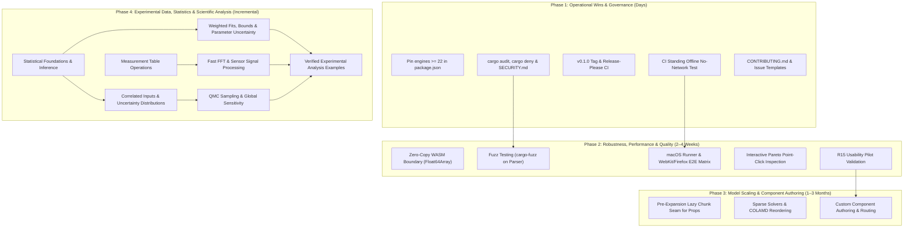

# Engineering Roadmap & Phased Execution Plan

This document outlines the phased engineering roadmap, active milestones, and quality acceptance gates for `frees` (`frees-wasm`).

---

## 1. Verified Architecture & Current Baseline

The project provides an end-to-end client-side WebAssembly modeling platform with zero external backend dependencies:

- **Target-Agnostic Core (`frees-core`)**: Scaled Newton-Raphson, Powell hybrid dogleg, adaptive ODE integrators (`ode45`, `radau5`), index-1 DAE BDF/IDA solver with event root-finding, and an exact rational symbolic CAS.
- **Thermodynamic Property Backbone (`rustprop`)**: Pure-Rust CoolProp 8.0.0 implementation supporting multiparameter Helmholtz energy equations of state, incompressibles (`INCOMP::MEG`, `MPG`), and ASHRAE moist air psychrometrics (`HAPropsSI`).
- **WebAssembly Bridge & Worker Pool (`frees`, `engineClient.ts`)**: Structured JSON RPC boundary hosting a pool of up to 4 Web Workers with dynamic concurrency clamping, request correlation, weighted sweep progress, and deterministic row re-assembly.
- **Interactive Workbench (`web`)**: React 19 / TypeScript application featuring Glide Data Grid virtualized tables, Plotly.js scientific plotting with thermodynamic diagram overlays, CodeMirror/Monaco editor support, shareable URL links (`#share=<lz-string>`), and offline PWA caching via IndexedDB.
- **Strict Quality Gates**: 1,308 golden regression fixtures passing with zero regressions, 54 frontend Vitest test suites (603 tests) passing, clean clippy `-D warnings` on native and `wasm32-unknown-unknown`, and WASM bundle strictly gated under the 4,096 KiB ceiling (~3,216 KiB raw).

---

## 2. Phased Implementation Plan



---

### Phase 1: Immediate Operational Wins & Governance (Target: Days)

Focus: Low-risk, high-impact developer ergonomics, supply-chain security, and release automation.

- [x] **1.1 Enforce Node 22 in Toolchain Configuration**
  - Add `"engines": { "node": ">=22" }` to `web/package.json` to prevent cryptic `jsdom` / `undici` initialization crashes under Node 20.
- [x] **1.2 Supply-Chain Hardening & Security Policy**
  - Integrate `cargo audit` and `cargo deny` (checking licenses, bans, and advisories) into `.github/workflows/ci.yml`.
  - Add `npm audit --omit=dev` to the frontend CI pipeline.
  - Author `SECURITY.md` establishing a formal vulnerability disclosure and triage protocol.
- [x] **1.3 Release Engineering & Automation**
  - Tag initial release `v0.1.0`.
  - Configure Release-Please to automate semantic version bumps and `CHANGELOG.md` generation from conventional commits.
  - Add automated GitHub release asset publishing: compiled WebAssembly package, zipped `web/dist` PWA artifact, and native `frees-cli` binaries for Linux, macOS, and Windows.
- [x] **1.4 Standing Offline ("No-Network") CI Invariant**
  - Add a dedicated Playwright test step in CI that routes all non-same-origin requests to `route.abort()` and verifies model solving, diagram plotting, and table export complete successfully offline.
- [x] **1.5 Contributor Onboarding & Issue Templates**
  - Add `CONTRIBUTING.md` detailing coding standards, PR expectations, and verification commands.
  - Configure GitHub issue templates (`.github/ISSUE_TEMPLATE/`) for bug reports, engine numerics, and documentation improvements.

---

### Phase 2: Robustness, Kernel Performance & Quality (Target: 2–4 Weeks)

Focus: Eliminating data transfer bottlenecks, preventing parser crashes, expanding test matrices, and validating user ergonomics.

- [x] **2.1 Zero-Copy Typed Array WASM Boundary**
  - Replace JSON string serialization for bulk numeric results (transient ODE trajectory tables and multi-row parametric sweeps) with `js_sys::Float64Array` and transferable `ArrayBuffer` views.
  - Maintain JSON envelopes for variable names, status codes, and units while transferring data matrices in $O(1)$ time across Web Workers via `postMessage(msg, [buffer])`.
  - Implementation: `solve_zerocopy` / `solve_table_zerocopy` keep bulk numeric cells out of JSON; the client returns parsed sweep objects and aligns chunk columns by name, preserving failed/missing cells as `NaN`.
  - Copy boundary: Rust copies once into JS-owned arrays (WASM memory cannot be detached). Worker transfer avoids a buffer copy; main-thread row hydration and chunk assembly remain O(cells) for the existing UI.
  - Regression checks cover legacy/typed numeric parity, failed rows, differing chunk columns, and sender-buffer detachment. The native JSON exports remain available.
  - Compiled-WASM coverage also verifies JS-owned buffer detachment, continued engine use after transfer, and structured errors. Optimized bundle measured 3,292,831 bytes (3,215.7 KiB) on 2026-09-08.
- [x] **2.2 Parser & Lexer Fuzz Testing (`cargo-fuzz`)**
  - Establish a `fuzz/` crate using `libFuzzer` targeting `frees_core::parser::parse_document` and expression evaluators.
  - Assert that randomized, malformed, or adversarial syntax inputs yield structured `Err(ParseError)` variants rather than triggering panic traps that kill the browser Web Worker.
  - Native-only `fuzz/` workspace adds seeded `parse_document` and `eval_expression` libFuzzer targets; CI runs each with a 60-second budget and retains failure artifacts. See [fuzz/README.md](fuzz/README.md) for replay and minimization.
  - Local AddressSanitizer smoke on 2026-09-08: 615,687 parser inputs and 463,908 evaluator inputs completed without crashes (61 seconds each). This bounded run supplements existing property tests; it is not exhaustive validation.
- [x] **2.3 Cross-Platform & Cross-Browser CI Matrix**
  - Add a macOS runner leg in CI to validate floating-point formatting and `libm` consistency across operating systems.
  - Expand Playwright test suites to run across a Chromium, Firefox, and WebKit (Safari) browser matrix to verify WebAssembly instantiation and IndexedDB storage resilience.
  - Notifications render below the main action bar; browser journeys exercise the real overlays. WebKit's offline-reload case remains explicitly skipped for its documented networking crash; external-network-blocked solving runs on all three browsers.
- [x] **2.4 Interactive Pareto Point-Click Inspection**
  - Enhance `web/src/MinMaxModal.tsx` so clicking any point on the 2D Pareto front scatter plot highlights the corresponding decision variables and allows instant loading of the operating point into the active document.
- [ ] **2.5 R15 Usability Pilot Validation**
  - Execute the structured R15 usability pilot with 5 engineering participants to validate core modeling tasks (scalar solve within 5 minutes, component chain within 10 minutes, missing boundary recovery within 3 minutes) prior to adding complex UI extensions.
  - [R15_PILOT.md](R15_PILOT.md) provides participant tasks, verified answer keys, timing/assistance rules and a five-participant results template. Human sessions and findings remain pending; automated browser journeys do not close this item.

---

### Phase 3: Model Scaling & Component Authoring (Target: 1–3 Months)

Focus: Thermodynamic data loading, large-scale sparse numerical solvers, and custom component authoring.

Items **3.1, 3.2, and 3.6 are deferred and excluded from active development**; their original IDs are retained in the deferred candidates below.

**Status audit, 2026-09-09.** None of 3.3, 3.4 or 3.5 is implemented. 3.4 is the one that is not greenfield — see its note.

- [ ] **3.3 Pre-Expansion Lazy Chunk Seam for Thermodynamic Data** — *premise expired; deferred behind a measured trigger*
  - Original scope: implement dynamic chunk fetching for property tables and component libraries (`props/tables.rs::install_from_bytes`) on first mention, to safeguard the $\le 4,096\text{ KiB}$ WASM budget before adding new fluids (Ammonia, Propane, Nitrogen, Methane).
  - Audit (2026-09-09): the **seam exists and the fetching does not** — `install_from_bytes` is public, tested and compiled into both builds, but nothing in `crates/frees` or `web/src` calls it at runtime. More importantly, the reason to build the fetching had evaporated: CO2 cost +25.5 KiB raw when Wave G2 linked it, and the module was sitting 822 KiB under the ceiling.
  - Resolution: the four fluids were linked outright instead. **Measured cost: +106.2 KiB raw / +88.6 KiB gzipped for all four**, leaving 716 KiB of headroom. That is the whole thing the lazy chunking existed to avoid spending.
  - Picker: all four went onto `served_fluids` the same day by owner request, after their diagram coverage was measured — a full 400-point dome on every `diagrams::Kind`, nine quality lines and seven T-s isobars each, better than CO2's three. Cost +72 bytes raw.
  - Remaining trigger for this item: **headroom below ~200 KiB**. Until then, linking a fluid is one line in `crates/frees-core/Cargo.toml` and the trigger/fetch/cache machinery is unbuilt complexity. Revisit if a large component library, a mixture database, or a fluid an order of magnitude bigger than a Helmholtz EoS arrives.
- [ ] **3.4 Sparse Matrix Factorization & Graph Reordering**
  - Implement Approximate Minimum Degree (AMD) and Column Approximate Minimum Degree (COLAMD) fill-reducing permutations.
  - Integrate pure-Rust sparse LU/QR factorizations (`faer` / `sprs`) with sparsity pattern reuse across Newton iterations for systems exceeding 5,000 equations.
  - Audit: **partially present, in the wrong place.** `crates/frees-core/src/dae/colamd.rs` already implements a COLAMD-lite ordering (AMD on the column-intersection graph, no supercolumn absorption, deterministic tie-breaking) and `dae/solver.rs` runs it in front of a Gilbert–Peierls sparse LU. But it is `pub(crate)`, it is reached only from the DAE path, and its own docs accept `O(n²)` because "`n` is a DAE dimension, tens to low hundreds". There is no AMD proper, no sparse QR, no `faer`/`sprs` dependency, no pattern reuse across Newton iterations, and nothing wired into the general solver. Extend and lift what is there rather than starting a second sparse stack.
- [ ] **3.5 Custom Component Authoring & Advanced Schematic Routing**
  - Provide a UI workflow for selecting a group of components on the schematic canvas and encapsulating them into a reusable custom `COMPONENT` block with exposed ports.
  - Implement obstacle-avoiding orthogonal wire routing with connection validation.
  - Audit: **not started.** `web/src/schematic/` has layout, wiring validation, palette and symbols, but no encapsulation workflow and no routing code — `layout.ts` contains no orthogonal, obstacle-avoiding or elbow routing at all.

---

### Phase 4: Experimental Data, Statistics & Scientific Analysis (Target: Incremental Releases)

Focus: Complete the engineering workflow from measured data to a fitted physical model, quantified uncertainty, and a validated conclusion. Deliver foundations and fitting first, then richer uncertainty, measurement processing, and global sensitivity; this phase does not require completion of every active Phase 3 task.

**Existing foundation to reuse:** descriptive statistics (including RMS), normal distribution functions, a chi-square CDF, seeded uniform/Gaussian draws, linear/polynomial/nonlinear fitting, bounded dynamic parameter calibration, first-order uncertainty, Monte Carlo, CSV tables, histograms, dense QR/Cholesky/SVD, splines, and control analysis. These are extensions to current engine/API/workbench paths, not replacement subsystems.

- [x] **4.1 Statistical Foundations & Experimental Inference**
  - Add sample covariance matrices, Pearson/Spearman correlation, weighted mean/variance, and robust summaries (median absolute deviation, trimmed mean, skewness, kurtosis), with explicit weight and sample/population conventions.
  - Add Student-t and F distribution primitives, then confidence intervals for means, one-sample/paired/Welch t-tests, one-way ANOVA, and chi-square goodness-of-fit tests. Preserve `chi_square(x, df)` as a CDF; give hypothesis tests distinct names and structured results (statistic, degrees of freedom, p-value, assumptions).
  - Add seeded bootstrap confidence intervals and permutation tests. Define finite-value/missing-data policy, minimum sample counts, constant-data behavior, and confidence level explicitly; distinguish sample spread, standard error, and confidence intervals.
  - Implementation: `crates/frees-core/src/descriptive.rs` holds the kernels; `eval.rs` dispatches 43 names — `cov`, `pearson`/`corrcoef`, `spearman`, `wmean`, `wvar`, `trimmedmean`, `skewness`, `kurtosis`, `mad`, `tpdf`/`tcdf`/`tinv`, `fpdf`/`fcdf`/`finv`, `betainc`, `ci_mean_lo`/`_hi`, `ttest1_*`, `ttest_paired_*`, `ttest2_*` (Welch), `anova1_*`, `chi2gof_*`, `bootstrap_ci_*`, `permtest_*`.
  - Conventions: sample (n − 1) denominators; reliability (not frequency) weights for `wvar`; structured results are reached through one accessor name per output (`*_stat`, `*_pval`, `*_df`) rather than a tuple return, matching the existing `slope`/`intercept`/`r2` split. Scalar arguments precede vector arguments (`ci_mean_lo(0.95, [...])`), matching `trimmedmean`. Vectors are list literals, as for `slope`/`intercept`/`r2`; table-column plumbing belongs to 4.4.
  - `chi_square(x, df)` is unchanged and still a CDF. `betainc` and `fcdf` are verified against closed-form and quadrature references (`I_0.3(2,5) = 0.579825`, `F(5,10)` CDF at 3 = 0.93444243790617); reference values quoted in earlier drafts of these tests were wrong and were corrected, not the kernels.
  - Bundle cost: 3,251.0 KiB raw / 1,323.7 KiB gzipped on 2026-09-09, 845 KiB under the 4,096 KiB ceiling. Reference-page documentation for these names is 4.7's scope.
- [ ] **4.2 Weighted & Bounded Fitting with Parameter Uncertainty** — *curve fitting complete; dynamic calibration pending*
  - Extend `analysis/curvefit.rs` and the existing Curve Fit UI/API with measurement standard deviations or error covariance, real parameter bounds, and robust losses. Reuse the existing calibration workflow's bound conventions; its bounds already work independently of curve fitting.
  - Report parameter covariance, standard errors, confidence/prediction bands, and rank/conditioning diagnostics alongside existing R², RMSE, residuals, and fitted values. Flag unidentifiable fits rather than presenting misleading finite uncertainty; document local-linear approximations and residual degrees of freedom.
  - Support multiple predictor columns and carry weighting/diagnostics into dynamic parameter calibration where applicable. Reuse existing QR/SVD kernels rather than solving least squares through explicit normal-equation inversion.
  - Engine (done): `curvefit::fit` takes a `CurveFitRequest` carrying `sigma`, `lower`/`upper`, `loss` and `f_scale`, and multiple predictor columns via `x_variables`/`x_data`. Bounds are projected Levenberg-Marquardt (each trial point clamped, trust-region bookkeeping measuring the clamped step); robust losses are IRLS over the same LM with a MAD-based scale. Covariance comes off an SVD of the Jacobian at the optimum, never a `JᵀJ` inversion. `FitResult` reports covariance, standard errors, residual dof, rank, condition number, `unidentifiable` and `at_bound`; rank-deficient or zero-dof fits report `NaN`/`null` rather than a plausible number. `Loss::Linear` with no σ and no bounds skips every added multiplication, so all eight Java oracle goldens still pass iterate for iterate.
  - Bands (done): confidence and prediction bands at each data point, `fitted ± t(1 − α/2, dof) · se`, with the curve variance `jᵀ Σ j` by the delta method and the prediction band adding the measurement variance (that point's σ², or the estimated residual variance). `confidence` selects the level and falls back to 0.95 outside `(0, 1)`. Verified against the textbook simple-regression formulas using the closed-form `df = 3` t quantile, 3.1824463052837064.
  - Boundary (done): `curve_fit` accepts `sigma`, `xVariables`/`xColumns`, `lowerBounds`/`upperBounds`, `loss`, `fScale` and `confidence`, and returns `parameterStdErrors`, `parameterCovariance`, `residualDof`, `rank`, `conditionNumber`, `unidentifiable`, `reducedChiSquare`, `atBound` and the four band arrays. Non-finite values cross as JSON `null`.
  - UI (done): both fit dialogs take per-point uncertainties (a third column manually, a column picker from a table), bounds, loss, outlier scale and confidence level behind a collapsed advanced section, and report standard errors, an "at bound" badge, residual dof, rank, condition number and reduced χ², with the confidence and prediction ribbons plotted over the data. Unavailable values render as an em dash, never as 0.
  - Remaining: carrying weighting and diagnostics into dynamic parameter calibration (`analysis/paramfit.rs`).
- [ ] **4.3 Correlated & Non-Gaussian Uncertainty**
  - Extend input uncertainty specifications with validated covariance/correlation matrices and propagate first-order covariance through the model (`J Σ Jᵀ`), retaining the current independent-input behavior when no correlations are supplied.
  - Add selectable uniform, triangular, lognormal, Weibull, and beta distributions alongside normal inputs. Implement proper truncated sampling; the current bound-clamped Gaussian sampler must remain explicitly identified if retained for compatibility.
  - Add correlated Gaussian sampling first. Reject unsupported combinations of non-Gaussian marginals and correlation rather than silently ignoring dependence. Validate distribution parameters, covariance symmetry/positive semidefiniteness, units, and bounds.
  - Expose sampling-error/convergence diagnostics, failed-sample counts, and configurable output quantiles. Preserve seeded reproducibility and cancellation/budget behavior; distinguish output quantiles from confidence intervals on their estimates.
- [ ] **4.4 Practical Measurement Table Operations**
  - Extend the existing Tables workbook with row filtering, selected-column transforms, grouped summaries, rolling statistics, and joins/alignment by a chosen key or time column.
  - Make missing-value handling, rejected rows, duplicate keys, interpolation, and extrapolation policies visible. Preserve units and source data when producing derived tables; feed those tables directly into fitting and plots.
  - Add box plots, ECDFs, and fit confidence/prediction overlays using the installed plotting stack. Histograms already exist; avoid a separate data-analysis application or a general DataFrame clone.
- [ ] **4.5 Sensor Signal Processing & Fast Transforms**
  - Replace the O(n²) direct DFT behind `FFT`/`IFFT` with an O(n log n) implementation supporting arbitrary lengths, while preserving complex input/output and inverse normalization. Verify awkward/prime lengths as well as powers of two.
  - Add detrending, window functions, smoothing, digital filtering (including zero-phase filtering), peak detection, cross-correlation, Welch power spectra, and STFT/spectrograms in small independently usable increments.
  - Define sample-rate, time-axis, edge/transient, spectral scaling, and units conventions. Provide anti-alias filtering for downsampling and explicit treatment of irregularly sampled data.
- [ ] **4.6 Efficient Sampling & Global Sensitivity**
  - Add seeded Latin-hypercube and scrambled Sobol sampling to the existing Monte Carlo workflow; report the actual completed sample design when interrupted and avoid applying i.i.d. error estimates to QMC results.
  - Add Sobol first-order/total-order sensitivity indices and Morris screening, with estimator uncertainty and documented input assumptions. Keep local uncertainty contributions distinct from global sensitivity and reject unsupported correlated-input designs.
  - Reuse the existing worker pool, revision checks, and deterministic result ordering where batch execution is appropriate; do not introduce another scheduler.
- [ ] **4.7 Scientific Validation, Documentation & Acceptance**
  - Add analytical fixtures and independently generated reference cases from NumPy/SciPy/statsmodels/SALib, recording versions, estimator conventions, seeds, and tolerances. Reference generation may use Python; shipping and offline CI replay must not require Python or network access.
  - Cover small/degenerate samples, singular covariance, rank-deficient fits, active parameter bounds, outliers, truncated distributions, and known correlated linear models. Validate stochastic estimators statistically rather than expecting identical random streams across libraries.
  - Add end-to-end examples for sensor calibration with confidence bands, correlated instrument uncertainty, noisy-signal spectral analysis, and global sensitivity of an engineering model. Document new functions in the existing reference/catalog and expose consistent Rust/WASM/UI behavior.
  - Benchmark transform scaling and representative fitting/sampling workloads; retain the existing offline, cancellation, regression, browser, and WASM-size gates. Ship and verify each increment before broadening scope.

**Scope boundary:** general N-dimensional array execution, public sparse APIs, additional LP/MILP/gradient optimizers, BVP/PDE tooling, broad symbolic algebra, ML/Bayesian programming, and GPU/distributed execution remain separate candidates requiring a concrete workload. Coordinate sparse execution with Phase 3.4. Standalone code export (3.2) is deferred and is not a dependency of this phase. Neither an internal sparse solver nor compiled Rust/WASM implies NumPy/Numba/JAX execution parity.

**Reference baselines:** [NumPy routines](https://numpy.org/doc/stable/reference/routines.html), [SciPy statistics](https://docs.scipy.org/doc/scipy/reference/stats.html), [curve fitting](https://docs.scipy.org/doc/scipy/reference/generated/scipy.optimize.curve_fit.html), [robust least squares](https://docs.scipy.org/doc/scipy/reference/generated/scipy.optimize.least_squares.html), [signal processing](https://docs.scipy.org/doc/scipy/reference/signal.html), [QMC](https://docs.scipy.org/doc/scipy/reference/stats.qmc.html), [statsmodels](https://www.statsmodels.org/stable/user-guide.html), and [SALib](https://salib.readthedocs.io/en/latest/). Comparison reviewed 2026-09-08; capability references are not runtime dependencies.

---

## 3. Long-Term Research, Strategic & Optional Candidates

The following former Phase 3 items are deferred, unscheduled, and excluded from development until explicitly reactivated:

- **Deferred — 3.1 Standalone Language Server (`crates/frees-lsp`)**
  - Author a dedicated LSP server crate communicating over standard input/output.
  - Reuse `frees-core` AST parsing, unit checking, diagnostics, and component metadata to deliver real-time syntax highlighting, error squiggles, unit checking, autocomplete, and go-to-definition in VS Code, Neovim, and Helix.
- **Deferred — 3.2 Standalone Simulation Code Export (Python & C++)**
  - Implement an AST visitor exporting solved equation blocks and topological schedules to standalone Python scripts (using SciPy `fsolve` and `solve_ivp`) and self-contained C++ headers.
  - Provide engineers with auditable, citable, and dependency-free artifacts for embedding in enterprise simulation pipelines.
- **Deferred — 3.6 Comprehensive Documentation & Public Example Gallery**
  - Build an mdBook ("The frees Book") compiling language syntax, physical modeling principles, thermodynamic EoS fundamentals, and solver debugging guides.
  - Curate a public gallery of 30–50 verified engineering models from the regression corpus with interactive simulation previews.

- **Crates.io Publishing for Dependencies & Core Engine**: Publish `rustprop` to crates.io and update `Cargo.toml` from a git tag dependency to a versioned registry dependency with cryptographic checksums once upstream release cadence stabilizes. Publish `frees-core` and `frees-cli` to crates.io for embedding in external Rust applications.
- **SharedArrayBuffer Multi-Threading**: Research cross-origin isolation (`COOP`/`COEP`) headers for zero-copy multi-threaded sweeps, with seamless fallback for standard static hosting environments.
- **Neural & Domain-Bounded Surrogate Property Models**: Train bounded surrogate evaluators for fast property estimation during Newton line-search steps, with exact Helmholtz verification at convergence.
- **Standards Interoperability (FMI / FMU 2.0/3.0)**: Package dynamic systems as Functional Mock-up Units for co-simulation in industrial engineering workflows.
- **Accessibility & Touch Ergonomics**: Full WCAG 2.1 AA compliance, enhanced screen reader announcements, and tactile multi-touch canvas navigation.

---

## 4. Quality & Change Control Acceptance Gates

Every proposed change to the codebase must pass all automated verification gates prior to integration:

### 1. Rust Engine Quality Gates

```bash
# Code formatting check
cargo fmt --all --check

# Strict linting across native and wasm targets
cargo clippy --workspace --all-targets -- -D warnings
cargo clippy --workspace --target wasm32-unknown-unknown --all-targets -- -D warnings

# Core unit and integration test suite
cargo test --workspace -- --skip golden_corpus_parity

# Full golden regression corpus replay (1,308 fixtures)
cargo test --release --test parity
```

- **Zero Regression Policy**: All 1,308 golden fixtures must pass within declared tolerance specifications (`fixtures/tolerances-rustprop.json`).
- **Dead Tolerance Detection**: Relaxed tolerances that become unnecessary must be removed; CI fails if an unused tolerance entry remains.

### 2. Frontend & WebAssembly Gates

```bash
# Frontend test suite (Node 22 required)
cd web && npm test

# ESLint code quality verification
npm run lint

# Production bundle compilation and PWA asset generation
npm run build
```

- **Node 22 Toolchain Requirement**: Pinned in `web/.nvmrc` and enforced via `package.json`.
- **Bundle Budget Ceiling**: The compiled WebAssembly engine (`frees.wasm`) must strictly remain $\le 4,096\text{ KiB}$ raw. Any PR exceeding this budget fails CI automatically.

### 3. Implementation Invariants

1. **Root-Cause Engineering**: Address bugs and inefficiencies at their fundamental source in the compiler or solver, rather than introducing conditional patches in callers.
2. **Target Agnosticism**: Keep `crates/frees-core` free of browser-specific or WASM-specific APIs.
3. **Model Revision Integrity**: Always verify `isCurrent(revision)` before committing asynchronous solver or sweep results to the user interface.
4. **Symbol Case-Insensitivity**: Maintain case-insensitive identifier lookup in the engine while preserving declared casing in user-facing tables and display maps.
